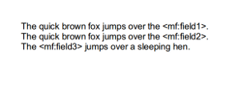

Table of Contents
=================

   * [Table of Contents](#table-of-contents)
   * [I. Introduction](#i-introduction)
      * [Prerequisites](#prerequisites)
      * [Overview of the Monopond Fax API](#overview-of-the-monopond-fax-api)
   * [II. API Access and General Usage](#ii-api-access-and-general-usage)
      * [API Web Service](#api-web-service)
      * [Building a Request](#building-a-request)
         * [SOAP Envelope](#soap-envelope)
         * [Authorisation Headers](#authorisation-headers)
   * [III. Function Definitions](#iii-function-definitions)
      * [SendFax](#sendfax)
         * [Description](#description)
         * [Sending a single fax:](#sending-a-single-fax)
         * [Sending a Fax with Retries inside a FaxMessage](#sending-a-fax-with-retries-inside-a-faxmessage)
         * [Sending a Fax with Retries inside a SendFaxRequest](#sending-a-fax-with-retries-inside-a-sendfaxrequest)
         * [Sending a Fax with BusyRetries inside a FaxMessage](#sending-a-fax-with-busyretries-inside-a-faxmessage)
         * [Sending a Fax with BusyRetries inside a SendFaxRequest](#sending-a-fax-with-busyretries-inside-a-sendfaxrequest)
         * [Sending a Fax with Resolution in FaxMessage](#sending-a-fax-with-resolution-in-faxmessage)
         * [Sending a Fax with FaxDitheringTechnique in FaxDocument:](#sending-a-fax-with-faxditheringtechnique-in-faxdocument)
         * [Assigning a Timezone in FaxMessage](#assigning-a-timezone-in-faxmessage)
         * [Assigning a Timezone in SendFaxRequest](#assigning-a-timezone-in-sendfaxrequest)
         * [Assigning SendFrom in FaxMessage](#assigning-sendfrom-in-faxmessage)
         * [Assigning SendFrom in SendFaxRequest](#assigning-sendfrom-in-sendfaxrequest)
         * [Assigning a HeaderFormat in FaxMessage](#assigning-a-headerformat-in-faxmessage)
         * [Assigning a HeaderFormat in SendFaxRequest](#assigning-a-headerformat-in-sendfaxrequest)
         * [Assigning CLI in FaxMessage](#assigning-cli-in-faxmessage)
         * [Sending a Fax with DNCR enabled in FaxMessage](#sending-a-fax-with-dncr-enabled-in-faxmessage)
         * [Sending a Fax with FPS enabled in FaxMessage](#sending-a-fax-with-fps-enabled-in-faxmessage)
         * [Sending a Fax with Smartblock enabled in FaxMessage](#sending-a-fax-with-smartblock-enabled-in-faxmessage)
         * [Sending a Fax with ScheduledStartTime in FaxMessage](#sending-a-fax-with-scheduledstarttime-in-faxmessage)
         * [Sending a Fax with MustBeSentBeforeDate in FaxMessage](#sending-a-fax-with-mustbesentbeforedate-in-faxmessage)
         * [Sending a Fax with MaxFaxPages in FaxMessage](#sending-a-fax-with-maxfaxpages-in-faxmessage)
         * [Sending Multiple Faxes](#sending-multiple-faxes)
         * [Sending faxes to multiple destinations with the same document (broadcasting)](#sending-faxes-to-multiple-destinations-with-the-same-document-broadcasting)
         * [Sending Microsoft Documents With DocMergeData:](#sending-microsoft-documents-with-docmergedata)
         * [Sending Tiff files with StampMergeData:](#sending-tiff-files-with-stampmergedata)
         * [Response](#response)
         * [SOAP Faults](#soap-faults)
      * [FaxStatus](#faxstatus)
         * [Description](#description-1)
         * [Request](#request)
         * [Response](#response-1)
         * [SOAP Faults](#soap-faults-1)
      * [StopFax](#stopfax)
         * [Description](#description-2)
         * [Request](#request-1)
         * [Response](#response-2)
         * [SOAP Faults](#soap-faults-2)
      * [PauseFax](#pausefax)
         * [Description](#description-3)
         * [Request](#request-2)
         * [Response](#response-3)
         * [SOAP Faults](#soap-faults-3)
      * [ResumeFax](#resumefax)
         * [Request](#request-3)
         * [Response](#response-4)
         * [SOAP Faults](#soap-faults-4)
      * [FaxDocumentPreview](#faxdocumentpreview)
         * [Description](#description-4)
         * [Request](#request-4)
         * [Response](#response-5)
         * [SOAP Faults](#soap-faults-5)
      * [SaveFaxDocument](#savefaxdocument)
         * [Description](#description-5)
         * [Request](#request-5)
         * [Sample Request](#sample-request-2)
         * [SOAP Faults](#soap-faults-6)
      * [DeleteFaxDocument](#deletefaxdocument)
         * [Description](#description-6)
         * [Request](#request-6)
         * [SOAP Faults](#soap-faults-7)
   * [IV. Outbound Callback Service](#iv-outbound-callback-service)
      * [Description](#description-7)
      * [Request](#request-7)
   * [V. Inbound Callback Service](#v-inbound-callback-service)
      * [Description](#description-8)
      * [Callback Settings](#callback-settings)
         * [Description](#description-9)
         * [Setting the callback settings](#setting-the-callback-settings)
         * [Getting the callback settings](#getting-the-callback-settings)
      * [Fax Number](#fax-number)
         * [Description](#description-10)
         * [Buying a Fax Number](#buying-a-fax-number)
            * [Subscribe Phone Numbers](#subscribe-phone-numbers)
            * [Show User Subscription Request](#show-user-subscription-request)
            * [Unsubscribe Phone Number](#unsubscribe-phone-number)
            * [Unsubscribe Inactive Phone Number](#unsubscribe-inactive-phone-number)
            * [Phone Number Subscription User Request Response Body](#phone-number-subscription-user-request-response-body)
      * [Fax Number Settings](#fax-number-settings)
         * [Description](#description-11)
            * [Update Incoming Fax Number Settings](#update-incoming-fax-number-settings)
            * [Incoming Fax Number Settings Request Body](#incoming-fax-number-settings-request-body)
            * [User Simplified Entity](#user-simplified-entity)
   * [VI. More Information](#vi-more-information)
      * [Exceptions/SOAP Faults](#exceptionssoap-faults)
         * [InvalidArgumentsException](#invalidargumentsexception)
         * [DocumentContentTypeNotFoundException](#documentcontenttypenotfoundexception)
         * [DocumentRefAlreadyExistsException](#documentrefalreadyexistsexception)
         * [DocumentContentTypeNotFoundException](#documentcontenttypenotfoundexception-1)
         * [NoMessagesFoundException](#nomessagesfoundexception)
         * [InternalServerException](#internalserverexception)
      * [General Parameters and File Formatting](#general-parameters-and-file-formatting)
         * [File Encoding](#file-encoding)
         * [Dates](#dates)
      * [List of Supported font names for StampMergeField TextValue](#list-of-supported-font-names-for-stampmergefield-textvalue)
   * [VII. API Examples](#vii-api-examples)
      * [SendFax](#sendfax-1)
         * [Sending a single fax message](#sending-a-single-fax-message)
         * [Sending multiple fax messages in a single request](#sending-multiple-fax-messages-in-a-single-request)
         * [Sending multiple documents in a single fax message](#sending-multiple-documents-in-a-single-fax-message)
      * [FaxStatus](#faxstatus-1)
         * [Status request with “brief” verbosity](#status-request-with-brief-verbosity)
         * [Status request with “details” verbosity](#status-request-with-details-verbosity)
         * [Status request with “results” verbosity](#status-request-with-results-verbosity)
         * [Status request with “all” verbosity](#status-request-with-all-verbosity)
      * [FaxDocumentPreview](#faxdocumentpreview-1)
         * [Fax Document Preview request](#fax-document-preview-request)
         * [Fax Document Preview request with normal resolution](#fax-document-preview-request-with-normal-resolution)
         * [Fax Document Preview request with extra dark dithering technique](#fax-document-preview-request-with-extra-dark-dithering-technique)
         * [Fax Document Preview request with fine resolution and turbo dithering technique](#fax-document-preview-request-with-fine-resolution-and-turbo-dithering-technique)
         * [Fax Document Preview request with fine resolution and single DocMergeData field](#fax-document-preview-request-with-fine-resolution-and-single-docmergedata-field)
         * [Fax Document Preview request with fine resolution and multiple DocMergeData fields](#fax-document-preview-request-with-fine-resolution-and-multiple-docmergedata-fields)
         * [Fax Document Preview request with fine resolution and StampMergeData Text field](#fax-document-preview-request-with-fine-resolution-and-stampmergedata-text-field)
         * [Fax Document Preview request with fine resolution and multiple StampMergeData Text fields](#fax-document-preview-request-with-fine-resolution-and-multiple-stampmergedata-text-fields)
         * [Fax Document Preview request with fine resolution and StampMergeData Image field](#fax-document-preview-request-with-fine-resolution-and-stampmergedata-image-field)
         * [Fax Document Preview request with fine resolution and multiple StampMergeData Image fields](#fax-document-preview-request-with-fine-resolution-and-multiple-stampmergedata-image-fields)
         * [Fax Document Preview request with fine resolution, multiple StampMergeData Text fields and StampMergeData Image field](#fax-document-preview-request-with-fine-resolution-multiple-stampmergedata-text-fields-and-stampmergedata-image-field)
         * [SendFaxRequest Parameters](#sendfaxrequest-parameters)
         * [FaxMessage Parameters](#faxmessage-parameters)
         * [FaxDocument Parameters](#faxdocument-parameters)
         * [FaxDitheringTechnique](#faxditheringtechnique)
         * [Resolution Levels](#resolution-levels)
         * [Header Format](#header-format)
         * [Blocklists Parameters](#blocklists-parameters)
      * [Inbound Fax Callback](#inbound-fax-callback)
         * [Callback Settings Parameters](#callback-settings-parameters)
         * [Number Subscription Request Parameters](#number-subscription-request-parameters)


# I. Introduction

## Prerequisites
To gain access to the system you must have a Monopond user account that is flagged with Fax API privileges. 
Please note some features described in this document will require access controls to be enacted. Examples of this include enabling specific destinations, filtering options and/or retry settings.

All of the above items can be organised through consulting with your account manager.

## Overview of the Monopond Fax API
This SOAP-based API brings you the ability to send faxes programmatically from your applications.

Using this API you are able to both send a single document to a single destination and, or broadcast a single document to multiple destinations. In either scenario you can manage fax related parameters individually, such as:

Enabling support for specific blocking filters:

+ Australia: Do Not Call Register (DNCR)
+ UK: Fax Preference Service (FPS)

Customising connection settings:

+ Transmitting Subscriber Identification (TSID) string to identify you as the sender of the fax.
+ The number of retries when attempting to connect.
+ Resolution setting of the fax document.
+ The header format and content that appears at the top of the transmitted fax.

Scheduling options:

+ Specify the date and time you would like the transmission to start.

# II. API Access and General Usage
## API Web Service
The API is available as a SOAP Web Service. This service includes a WSDL which describes the functionality available in the interface, and can be used by many programming tools (such as Apache Axis/WSDL2Java and Microsoft Visual Studio) to generate client code without the need of programming a library, thus making the Monopond Fax API programming language-agnostic and OS-independent.

To access the API, use the following URLs:

Test WSDL: https://test.api.monopond.com/fax/soap/v2.1/?wsdl

Production WSDL: https://faxapi.monopond.com/api/fax/v2.1?wsdl

## Building a Request
### SOAP Envelope 
If you are using the WSDL to generate your client you won’t need to worry about this per-se, but it is handy to know what is happening underneath the hood.

The SOAP envelope provides a wrapper around each API request, defining the XML document as a SOAP message. The namespace definitions in this XML element are required. If they are missing, the server will generate a fault and discard the request.

The envelope consists of two sections; a header and a body. The header contains authentication information and is explained in the next document section. The body contains the fax request information when making each function call and is described in the function definitions throughout this document.

An example of a SOAP envelope for the Monopond Fax API is shown below with the header and body information omitted.
```xml
<soapenv:Envelope xmlns:soapenv="http://schemas.xmlsoap.org/soap/envelope/" xmlns:wsse="http://docs.oasis-open.org/wss/2004/01/oasis-200401-wss-wssecurity-secext-1.0.xsd" xmlns:v2="https://api.monopond.com/fax/soap/v2">
    <soapenv:Header>
        ...
    </soapenv:Header>
    <soapenv:Body>
        ...
    </soapenv:Body>
</soapenv:Envelope>
```
### Authorisation Headers
The Monopond Fax API uses WS-Security to authorise users on the platform. The WS-Security specification allows users to authenticate against SOAP services using a variety of different models.
When connecting to the Monopond Fax API you must use the UsernameToken security token format whichformat, which authenticates based on your Monopond username and password.

Applying these security headers will differ based on your API integration/connection method.

When using the WSDL to generate your SOAP client you may use a WS-Security library from your programming language to apply the headers to this SOAP service. Below is an example of applying these headers in Java using WSS4J interceptors:

```java
Map<String,Object> outProps = new HashMap<String,Object>();
outProps.put(WSHandlerConstants.ACTION, WSHandlerConstants.USERNAME_TOKEN);
outProps.put(WSHandlerConstants.USER, ”username”);
outProps.put(WSHandlerConstants.PW_CALLBACK_REF, new CallbackHandler() {
	public void handle(Callback[] callbacks) throws IOException, UnsupportedCallbackException {
		WSPasswordCallback pc = (WSPasswordCallback) callbacks[0];
		pc.setPassword(“password”);
	}
});
outProps.put(WSHandlerConstants.PASSWORD_TYPE, WSConstants.PW_TEXT);
factory.getOutInterceptors().add(new WSS4JOutInterceptor(outProps));
```

Alternatively if you are sending raw XML to the API you will need to apply the security headers to the request yourself following the example below:

```xml
...
    <soapenv:Header>
        <wsse:Security soapenv:mustUnderstand="1">
            <wsse:UsernameToken>
                <wsse:Username>username</wsse:Username>
                <wsse:Password>password</wsse:Password>
            </wsse:UsernameToken>
      </wsse:Security>
    </soapenv:Header>
...
```
# III. Function Definitions
## SendFax
### Description
This is the core function in the API allowing you to send faxes on the platform. 

Your specific faxing requirements will dictate which send request type below should be used. The two common use cases would be the sending of a single fax document to one destination and the sending of a single fax document to multiple destinations.

### Sending a single fax:
To send a fax to a single destination a request similar to the following example can be used:

```xml
<v2:SendFaxRequest>
    <FaxMessages>
        <FaxMessage>
            <MessageRef>test-1-1-1</MessageRef>
            <SendTo>6011111111</SendTo>
            <Documents>
                <Document>
                    <FileName>test.txt</FileName>
                    <FileData>VGhpcyBpcyBhIGZheA==</FileData>
                </Document>
            </Documents>
        </FaxMessage>
    </FaxMessages>
</v2:SendFaxRequest>
```

You can visit the following properties of Document, FaxMessage, and SendFaxRequest to know its definitions:
* [FaxDocument Parameters](#faxdocument-parameters)
* [FaxMessage Parameters](#faxmessage-parameters)
* [SendFaxRequest Parameters](#sendfaxrequest-parameters)

### Sending a Fax with Retries inside a FaxMessage
To set-up a fax to have retries a request similar to the following example can be used.
```xml
<v2:SendFaxRequest>
    <FaxMessages>
        <FaxMessage>
            <MessageRef>test-1-1-1</MessageRef>
            <SendTo>6011111111</SendTo>
            <Retries>2</Retries>
            <Documents>
                <Document>
                    <FileName>test.txt</FileName>
                    <FileData>VGhpcyBpcyBhIGZheA==</FileData>
                </Document>
            </Documents>
        </FaxMessage>
    </FaxMessages>
</v2:SendFaxRequest>
```

You can visit the following properties of Document and FaxMessage to know its definitions:
* [FaxDocument Parameters](#faxdocument-parameters)
* [FaxMessage Parameters](#faxmessage-parameters)

### Sending a Fax with Retries inside a SendFaxRequest
To set-up a fax to have retries a request similar to the following example can be used.
```xml
<v2:SendFaxRequest>
    <Retries>2</Retries>
    <FaxMessages>
        <FaxMessage>
            <MessageRef>test-1-1-1</MessageRef>
            <SendTo>6011111111</SendTo>
            <Documents>
                <Document>
                    <FileName>test.txt</FileName>
                    <FileData>VGhpcyBpcyBhIGZheA==</FileData>
                </Document>
            </Documents>
        </FaxMessage>
    </FaxMessages>
</v2:SendFaxRequest>
```

You can visit the following properties of Document and SendFaxRequest to know its definitions:
* [FaxDocument Parameters](#faxdocument-parameters)
* [SendFaxRequest Parameters](#sendfaxrequest-parameters)

### Sending a Fax with BusyRetries inside a FaxMessage
To set-up a fax to have busyRetries a request similar to the following example can be used.
```xml
<v2:SendFaxRequest>
    <FaxMessages>
        <FaxMessage>
            <MessageRef>test-1-1-1</MessageRef>
            <SendTo>6011111111</SendTo>
            <BusyRetries>2</BusyRetries>
            <Documents>
                <Document>
                    <FileName>test.txt</FileName>
                    <FileData>VGhpcyBpcyBhIGZheA==</FileData>
                </Document>
            </Documents>
        </FaxMessage>
    </FaxMessages>
</v2:SendFaxRequest>
```

You can visit the following properties of Document and FaxMessage to know its definitions:
* [FaxDocument Parameters](#faxdocument-parameters)
* [FaxMessage Parameters](#faxmessage-parameters)

### Sending a Fax with BusyRetries inside a SendFaxRequest
To set-up a fax to have busyRetries a request similar to the following example can be used.
```xml
<v2:SendFaxRequest>
	<BusyRetries>2</BusyRetries>
    <FaxMessages>
        <FaxMessage>
            <MessageRef>test-1-1-1</MessageRef>
            <SendTo>6011111111</SendTo>
            <Documents>
                <Document>
                    <FileName>test.txt</FileName>
                    <FileData>VGhpcyBpcyBhIGZheA==</FileData>
                </Document>
            </Documents>
        </FaxMessage>
    </FaxMessages>
</v2:SendFaxRequest>
```
You can visit the following properties of Document and SendFaxRequest to know its definitions:
* [FaxDocument Parameters](#faxdocument-parameters)
* [SendFaxRequest Parameters](#sendfaxrequest-parameters)

### Sending a Fax with Resolution in FaxMessage
To assign the fax resolution, a request similar to the following example can be used. 
```xml
<v2:SendFaxRequest>
    <FaxMessages>
        <FaxMessage>
            <MessageRef>test-1-1-1</MessageRef>
            <SendTo>6011111111</SendTo>
            <Resolution>fine</Resolution>
            <Documents>
                <Document>
                    <FileName>test.txt</FileName>
                    <FileData>VGhpcyBpcyBhIGZheA==</FileData>
                </Document>
            </Documents>
        </FaxMessage>
    </FaxMessages>
</v2:SendFaxRequest>
```
You can visit the definition of Resolution and its values here:
* [FaxMessage Parameters](#faxmessage-parameters)
* [Resolution Levels](#resolution-levels)

### Sending a Fax with FaxDitheringTechnique in FaxDocument:

To set the fax FaxDitheringTechnique, a request similar to the following example can be used. 

```xml
<v2:SendFaxRequest>
    <FaxMessages>
        <FaxMessage>
            <MessageRef>test-1-1-1</MessageRef>
            <SendTo>6011111111</SendTo>
            <Documents>
                <Document>
                    <FileName>test.txt</FileName>
                    <FileData>VGhpcyBpcyBhIGZheA==</FileData>
                    <DitheringTechnique>normal</DitheringTechnique>
                </Document>
            </Documents>
        </FaxMessage>
    </FaxMessages>
</v2:SendFaxRequest>
```
You can visit the definition of FaxDitheringTechnique here:
* [FaxDitheringTechnique](#faxditheringtechnique)

### Assigning a Timezone in FaxMessage

The Timezone is used to format the datetime display in the fax header.

```xml
<v2:SendFaxRequest>
    <FaxMessages>
        <FaxMessage>
            <MessageRef>test-1-1-1</MessageRef>
            <SendTo>6011111111</SendTo>
	    <TimeZone>Australia/Adelaide</TimeZone>
            <Documents>
                <Document>
                    <FileName>test.txt</FileName>
                    <FileData>VGhpcyBpcyBhIGZheA==</FileData>
                </Document>
            </Documents>
        </FaxMessage>
    </FaxMessages>
</v2:SendFaxRequest>
```

### Assigning a Timezone in SendFaxRequest

The Timezone is used to format the datetime display in the fax header. Applying it to the SendFaxRequest will apply this to all FaxMessages in the request.

```xml
<v2:SendFaxRequest>
    <TimeZone>Australia/Adelaide</TimeZone>
    <FaxMessages>
        <FaxMessage>
            <MessageRef>test-1-1-1</MessageRef>
            <SendTo>6011111111</SendTo>
            <Documents>
                <Document>
                    <FileName>test.txt</FileName>
                    <FileData>VGhpcyBpcyBhIGZheA==</FileData>
                </Document>
            </Documents>
        </FaxMessage>
    </FaxMessages>
</v2:SendFaxRequest>
```

### Assigning SendFrom in FaxMessage

To send fax with SendFrom in FaxMessage a request similar to the following example can be used.

```xml
<v2:SendFaxRequest>
    <FaxMessages>
        <FaxMessage>
            <MessageRef>test-1-1-1</MessageRef>
            <SendTo>6011111111</SendTo>
            <SendFrom>TSID</SendFrom>
            <Documents>
                <Document>
                    <FileName>test.txt</FileName>
                    <FileData>VGhpcyBpcyBhIGZheA==</FileData>
                </Document>
            </Documents>
        </FaxMessage>
    </FaxMessages>
</v2:SendFaxRequest>
```
You can visit here the definition of SendFrom:
* [FaxMessage Parameters](#faxmessage-parameters)

### Assigning SendFrom in SendFaxRequest
To send fax with SendFrom in SendFaxRequest a request similar to the following example can be used.
```xml
<v2:SendFaxRequest>
    <SendFrom>TSID</SendFrom>
    <FaxMessages>
        <FaxMessage>
            <MessageRef>test-1-1-1</MessageRef>
            <SendTo>6011111111</SendTo>
            <Documents>
                <Document>
                    <FileName>test.txt</FileName>
                    <FileData>VGhpcyBpcyBhIGZheA==</FileData>
                </Document>
            </Documents>
        </FaxMessage>
    </FaxMessages>
</v2:SendFaxRequest>
```
You can visit here the definition of SendFrom:
* [SendFaxRequest Parameters](#sendfaxrequest-parameters)

### Assigning a HeaderFormat in FaxMessage

Allows the header format that appears at the top of the transmitted fax to be changed.

```xml
<v2:SendFaxRequest>
    <FaxMessages>
        <FaxMessage>
            <MessageRef>test-1-1-1</MessageRef>
            <SendTo>6011111111</SendTo>
            <SendFrom>TSID</SendFrom>
            <HeaderFormat>From %from%, To %to%|%a %b %d %H:%M %Y</HeaderFormat>
            <Documents>
                <Document>
                    <FileName>test.txt</FileName>
                    <FileData>VGhpcyBpcyBhIGZheA==</FileData>
                </Document>
            </Documents>
        </FaxMessage>
    </FaxMessages>
</v2:SendFaxRequest>
```
This is the sample output of fax header using the header format above in the request:
```
	From TSID, To 6011111111 Wed Apr 26 09:33 2017 1 of 1
```

For more information, visit the following on how to setup the HeaderFormat value:
* [Header Format](#header-format)

### Assigning a HeaderFormat in SendFaxRequest

Allows the header format that appears at the top of the transmitted fax to be changed.

```xml
<v2:SendFaxRequest>
	<SendFrom>TSID</SendFrom>
	<HeaderFormat>From %from%, To %to%|%a %b %d %H:%M %Y</HeaderFormat>
	<FaxMessages>
		<FaxMessage>
			<MessageRef>test-1-1-1</MessageRef>
			<SendTo>6011111111</SendTo>
			<Documents>
		    	<Document>
			        <FileName>test.txt</FileName>
			        <FileData>VGhpcyBpcyBhIGZheA==</FileData>
		    	</Document>
			</Documents>
		</FaxMessage>
	</FaxMessages>
</v2:SendFaxRequest>
```
For more information, visit the following on how to setup the HeaderFormat value:
* [Header Format](#header-format)

### Assigning CLI in FaxMessage

Assigning a CLI in the FaxMessage, a request similar to the following example below.

```xml
<v2:SendFaxRequest>
	<FaxMessages>
		<FaxMessage>
			<MessageRef>test-1-1-1</MessageRef>
			<SendTo>6011111111</SendTo>
			<CLI>123</CLI>
			<Documents>
		    	<Document>
			        <FileName>test.txt</FileName>
			        <FileData>VGhpcyBpcyBhIGZheA==</FileData>
		    	</Document>
			</Documents>
		</FaxMessage>
	</FaxMessages>
</v2:SendFaxRequest>
```
You can visit here the definition of CLI:
* [FaxMessage Parameters](#faxmessage-parameters)

### Sending a Fax with DNCR enabled in FaxMessage

To check if a number is on the Do Not Call Register (Australian) before the fax is sent:

```xml
<v2:SendFaxRequest>
    <FaxMessages>
        <FaxMessage>
            <MessageRef>test-1-1-1</MessageRef>
            <SendTo>6011111111</SendTo>
            <Blocklists dncr="true" fps="false" smartblock="false" />
            <Documents>
                <Document>
                    <FileName>test.txt</FileName>
                    <FileData>VGhpcyBpcyBhIGZheA==</FileData>
                </Document>
            </Documents>
        </FaxMessage>
    </FaxMessages>
</v2:SendFaxRequest>

```
You can visit here the definition of Blocklists and its paremeters:
* [FaxMessage Parameters](#faxmessage-parameters)
* [Blocklists Parameters](#blocklists-parameters)

### Sending a Fax with FPS enabled in FaxMessage

To check if a number is on the FPS blacklist (UK) before the fax is sent:

```xml
<v2:SendFaxRequest>
    <FaxMessages>
        <FaxMessage>
            <MessageRef>test-1-1-1</MessageRef>
            <SendTo>6011111111</SendTo>
            <Blocklists dncr="false" fps="true" smartblock="false" />
            <Documents>
                <Document>
                    <FileName>test.txt</FileName>
                    <FileData>VGhpcyBpcyBhIGZheA==</FileData>
                </Document>
            </Documents>
        </FaxMessage>
    </FaxMessages>
</v2:SendFaxRequest>

```
You can visit here the definition of Blocklists and its paremeters:
* [FaxMessage Parameters](#faxmessage-parameters)
* [Blocklists Parameters](#blocklists-parameters)

### Sending a Fax with Smartblock enabled in FaxMessage

To check if a number is on the Smartblock list before the fax is sent:

```xml
<v2:SendFaxRequest>
    <FaxMessages>
        <FaxMessage>
            <MessageRef>test-1-1-1</MessageRef>
            <SendTo>6011111111</SendTo>
            <Blocklists dncr="false" fps="false" smartblock="true" />
            <Documents>
                <Document>
                    <FileName>test.txt</FileName>
                    <FileData>VGhpcyBpcyBhIGZheA==</FileData>
                </Document>
            </Documents>
        </FaxMessage>
    </FaxMessages>
</v2:SendFaxRequest>

```
You can visit here the definition of Blocklists and its paremeters:
* [FaxMessage Parameters](#faxmessage-parameters)
* [Blocklists Parameters](#blocklists-parameters)

### Sending a Fax with ScheduledStartTime in FaxMessage

To set a ScheduledStartTime for the FaxMessage, a request similar to the following can be used.

```xml
<v2:SendFaxRequest>
    <FaxMessages>
        <FaxMessage>
            <MessageRef>test-1-1-1</MessageRef>
            <SendTo>6011111111</SendTo>
            <ScheduledStartTime>2017-03-25T12:00:00Z</ScheduledStartTime>
            <Documents>
                <Document>
                    <FileName>test.txt</FileName>
                    <FileData>VGhpcyBpcyBhIGZheA==</FileData>
                </Document>
            </Documents>
        </FaxMessage>
    </FaxMessages>
</v2:SendFaxRequest>
```
To know more about ScheduledStartTime you can check it here:
* [FaxMessage Parameters](#faxmessage-parameters)

### Sending a Fax with MustBeSentBeforeDate in FaxMessage

To set a MustBeSentBeforeDate for FaxMessage, a request similar to the following can be used.

```xml
<v2:SendFaxRequest>
	<FaxMessages>
		<FaxMessage>
    		<MessageRef>test-1-1-1</MessageRef>
		    <SendTo>6011111111</SendTo>
		    <MustBeSentBeforeDate>2013-09-05T21:30:17+10:00</MustBeSentBeforeDate>
		    <Documents>
                <Document>
                    <FileName>test.txt</FileName>
                    <FileData>VGhpcyBpcyBhIGZheA==</FileData>
                </Document>
            </Documents>
        </FaxMessage>
    </FaxMessages>
</v2:SendFaxRequest>
```
To know more about MustBeSentBeforeDate you can check it here:
* [FaxMessage Parameters](#faxmessage-parameters)

### Sending a Fax with MaxFaxPages in FaxMessage

To set a MaxFaxPages for FaxMessage, a request similar to the following can be used.

```xml
<v2:SendFaxRequest>
	<FaxMessages>
		<FaxMessage>
    		<MessageRef>test-1-1-1</MessageRef>
		    <SendTo>6011111111</SendTo>
		    <MaxFaxPages>1</MaxFaxPages>
		    <Documents>
                <Document>
                    <FileName>test.txt</FileName>
                    <FileData>VGhpcyBpcyBhIGZheA==</FileData>
                </Document>
            </Documents>
        </FaxMessage>
        <FaxMessage>
    		<MessageRef>test-1-1-2</MessageRef>
		    <SendTo>6011111112</SendTo>
		    <MaxFaxPages>1</MaxFaxPages>
		    <Documents>
                <Document>
                    <FileName>test.txt</FileName>
                    <FileData>VGhpcyBpcyBhIGZheA==</FileData>
                </Document>
            </Documents>
        </FaxMessage>
    </FaxMessages>
</v2:SendFaxRequest>
```
To know more about MaxFaxPages you can check it here:
* [FaxMessage Parameters](#faxmessage-parameters)

### Sending Multiple Faxes
To send faxes to multiple destinations a request similar to the following example can be used. Please note the addition of another “FaxMessage”:

```xml
<v2:SendFaxRequest>
    <FaxMessages>
        <FaxMessage>
            <MessageRef>test-1-1-1</MessageRef>
            <SendTo>6011111111</SendTo>
            <SendFrom>Test Fax</SendFrom>
            <Documents>
                <Document>
                    <FileName>test.txt</FileName>
                    <FileData>VGhpcyBpcyBhIGZheA==</FileData>
                </Document>
            </Documents>
        </FaxMessage>
        <FaxMessage>
            <MessageRef>test-1-1-2</MessageRef>
            <SendTo> 6022222222</SendTo>
            <SendFrom>Test Fax</SendFrom>
            <Documents>
                <Document>
             <FileName>test.txt</FileName>
                    <FileData>VGhpcyBpcyBhIGZheA==</FileData>
                </Document>
            </Documents>
        </FaxMessage>
    </FaxMessages>
</v2:SendFaxRequest>
```

### Sending faxes to multiple destinations with the same document (broadcasting)
To send the same fax content to multiple destinations (broadcasting) a request similar to the example below can be used.

This method is recommended for broadcasting as it takes advantage of the multiple tiers in the send request. This eliminates the repeated parameters out of the individual fax message elements which are instead inherited from the parent send fax request. An example below shows “SendFrom” being used for both FaxMessages. While not shown in the example below further control can be achieved over individual fax elements to override the parameters set in the parent.

```xml
<v2:SendFaxRequest>
    <FaxMessages>
        <FaxMessage>
            <MessageRef>test-1-1-1</MessageRef>
            <SendTo>6011111111</SendTo>
        </FaxMessage>
        <FaxMessage>
            <MessageRef>test-1-1-2</MessageRef>
            <SendTo>6022222222</SendTo>
        </FaxMessage>
    </FaxMessages>
    <Documents>
        <Document>
            <FileName>test.txt</FileName>
            <FileData>VGhpcyBpcyBhIGZheA==</FileData>
        </Document>
    </Documents>
    <SendFrom>Test Fax</SendFrom>
</v2:SendFaxRequest>
```

When sending multiple faxes in batch it is recommended to group them into requests of around 600 fax messages for optimal performance. If you are sending the same document to multiple destinations it is strongly advised to only attach the document once in the root of the send request rather than attaching a document for each destination.

### Sending Microsoft Documents With DocMergeData:
(This request only works in version 2.1(or higher) of the fax-api.)

This request is used to send a Microsoft document with replaceable variables or merge fields. The merge field follows the pattern ```<mf:key>```.  If your key is ```field1```, it should be typed as ```<mf:field1>``` in the document. Note that the key must be unique within the whole document. The screenshots below are examples of what the request does.

Original .doc file:



This is what the file looks like after the fields ```field1```,```field2``` and ```field3``` have been replaced with values ```lazy dog```, ```fat pig``` and ```fat pig```:


##### Sample Request
The example below shows ```field1``` will be replaced by the value of ```Test```.

```xml
<v2:SendFaxRequest>
	<BroadcastRef>test-27</BroadcastRef>
	<SendRef>test-2-1</SendRef>
	<FaxMessages>
		<FaxMessage>
			<MessageRef>test-1-1-1</MessageRef>
			<SendTo>6011111111</SendTo>
			<Resolution>fine</Resolution>
		</FaxMessage>
	</FaxMessages>
	<Documents>
		<Document>
			<FileName>sample-docx-merge.docx</FileName>
			<FileData>VGhpcyBpcyBhIGZheA==</FileData>
			<DocMergeData>
				<MergeField>
					<Key>field1</Key>
					<Value>Test</Value>
				</MergeField>
			</DocMergeData>
		</Document>
	</Documents>
</v2:SendFaxRequest>
```

For more details, see [DocMergeData parameters section](#docMergeDataParameters) of this document.

### Sending Tiff files with StampMergeData:
(This request only works in version 2.1(or higher) of the fax-api.)

This request allows a TIFF file to be stamped with an image or text, based on X-Y coordinates. The x and y coordinates (0,0) starts at the top left part of the document. The screenshots below are examples of what the request does.

Original tiff file:


3
Sample stamp image:


This is what the tiff file looks like after stamping it with the image above:

 

The same tiff file, but this time, with a text stamp:

 

##### Sample Request

The example below shows a TIFF that will be stamped with the text “Hello” at xCoord=“1287” and yCoord=“421”, and an image at xCoord=“283” and yCoord=“120”

```xml
<v2:SendFaxRequest>
	<BroadcastRef>test-27</BroadcastRef>
	<SendRef>test-2-1</SendRef>
	<Resolution>normal</Resolution>
	<FaxMessages>
		<FaxMessage>
			<MessageRef>test-1-1-1</MessageRef>
			<SendTo>6011111111</SendTo>
		</FaxMessage>
	</FaxMessages>
	<Documents>
		<Document>
			<FileName>sample-tiff.tiff</FileName>
			<FileData>TiffDataInBase64==</FileData>
			<StampMergeData>
				<MergeField>
					<Key xCoord="1287" yCoord="421"/>
					<TextValue>Hello</TextValue>
				</MergeField>
				<MergeField>
					<Key xCoord="283" yCoord="120"/>
					<ImageValue width="100">
						<FileName>anImage.jpg</FileName>
						<FileData>imageDataInBaseSixtyFour==</FileData>
					</ImageValue>
				</MergeField>
			</StampMergeData>
		</Document>
	</Documents>
</v2:SendFaxRequest>
```

For more details, see [StampMergeData parameters section](#stampMergeDataParameters) of this document.

### Response
The response received from a SendFaxRequest matches the response you receive when calling the FaxStatus method call with a “send” verbosity level.

### SOAP Faults
This function will throw one of the following SOAP faults/exceptions if something went wrong:
**InvalidArgumentsException, NoMessagesFoundException, DocumentContentTypeNotFoundException, or InternalServerException.**
You can find more details on these faults in the next sSection 5 of this document.

## FaxStatus
### Description

This function provides you with a method of retrieving the status, details and results of fax messages sent. While this is a legitimate method of retrieving results we strongly advise that you take advantage of our callback service (see Section 4), which will push these fax results to you as they are completed.

When making a status request, you must provide at least a BroadcastRef, SendRef or MessageRef. The 
function will also accept a combination of these to further narrow the request query.
- Limiting by a BroadcastRef allows you to retrieve faxes contained in a group of send requests.
- Limiting by SendRef allows you to retrieve faxes contained in a single send request.
- Limiting by MessageRef allows you to retrieve a single fax message.

There are multiple levels of verbosity available in the request; these are explained in detail below. You can also find full examples in Section 6 of this document.

### Request
**FaxStatusRequest Parameters:**

| **Name** | **Required** | **Type** | **Description** |
|--- | --- | --- | --- | 
|**BroadcastRef**|  | *String* | User-defined broadcast reference. |
|**SendRef**|  | *String* | User-defined send reference. |
|**MessageRef**|  | *String* | User-defined message reference. |
|**Verbosity**|  | *String* | Verbosity String The level of detail in the status response. Please see below for a list of possible values.| 

**Verbosity Levels:**	
  
| **Value** | **Description** |
| --- | --- |
| **brief** | Gives you an overall view of the messages. This simply shows very high-level statistics, consisting of counts of how many faxes are at each status (i.e. processing, queued,sending) and totals of the results of these faxes (success, failed, blocked). |
| **send** | send Includes the results from ***“brief”*** while also including an itemised list of each fax message in the request. |
| **details** | details Includes the results from ***“send”*** along with details of the parameters used to send the fax messages. |
| **results** |Includes the results from ***“send”*** along with the sending results of the fax messages. |
| **all** | all Includes the results from both ***“details”*** and ***“results”*** along with some extra uncommon fields. |

### Response
The response received depends entirely on the verbosity level specified.

**FaxStatusResponse:**

| Name | Type | Verbosity | Description |
| --- | --- | --- | --- |
| **FaxStatusTotals** | *FaxStatusTotals* | *brief* | Counts of how many faxes are at each status. See below for more details. |
| **FaxResultsTotals** | *FaxResultsTotals* | *brief* | FaxResultsTotals FaxResultsTotals brief Totals of the end results of the faxes. See below for more details. |
| **FaxMessages** | *Array of FaxMessage* | *send* | send List of each fax in the query. See below for more details. |

**FaxStatusTotals:**

Contains the total count of how many faxes are at each status. 
To see more information on each fax status, view the FaxStatus table below.

| Name | Type | Verbosity | Description |
| --- | --- | --- | --- |
| **pending** | *Long* | *brief* | Fax is pending on the system and waiting to be processed.|
| **processing** | *Long* | *brief* | Fax is in the initial processing stages. |
| **queued** | *Long* | *brief* | Fax has finished processing and is queued, ready to send out at the send time. |
| **starting** | *Long* | *brief* | Fax is ready to be sent out. |
| **sending** | *Long* | *brief* | Fax has been spooled to our servers and is in the process of being sent out. |
| **pausing** | *Long* | *brief* | Fax has been told to pause. |
| **paused** | *Long* | *brief* | Fax is currently paused. |
| **resuming** | *Long* | *brief* | Fax has been told to resume. After the resume has been confirmed, it is set back to the “sending” status. |
| **stopping** | *Long* | *brief* | Fax has been told to stop. After the stop has been confirmed, it is set to the “finalizing” status. |
| **finalizing** | *Long* | *brief* | Fax has finished sending and the results are being processed.|
| **done** | *Long* | *brief* | Fax has completed and no further actions will take place. The detailed results are available at this status. |

**FaxResultsTotals:**

Contains the total count of how many faxes ended in each result, as well as some additional totals. To view more information on each fax result, view the FaxResults table below.

| Name | Type | Verbosity | Description |
| --- | --- | --- | --- |
| **success** | *Long* | *brief* | Fax has successfully been delivered to its destination.|
| **blocked** | *Long* |  *brief* | Destination number was found in one of the block lists. |
| **failed** | *Long* | *brief* | Fax failed getting to its destination.|
| **totalAttempts** | *Long* | *brief* |Total attempts made in the reference context.|
| **totalFaxDuration** | *Long* | *brief* |totalFaxDuration Long brief Total time spent on the line in the reference context.|
| **totalPages** | *Long* | *brief* | Total pages sent in the reference context.|

**FaxMessages:**

| Name | Type | Verbosity | Description |
| --- | --- | --- | --- |
| **messageRef** | *String* | *send* | |
| **sendRef** | *String* | *send* | |
| **broadcastRef** | *String* | *send* | |
| **sendTo** | *String* | *send* | |
| **status** |  | *send* | The current status of the fax message. See the FaxStatus table above for possible status values. |
| **FaxDetails** | *FaxDetails* | *details* | Contains the details and settings the fax was sent with. See below for more details. |
| **FaxResults** | *Array of FaxResult* | *results* | Contains the results of each attempt at sending the fax message and their connection details. See below for more details. |

**FaxDetails:**

| Name | Type | Verbosity |
| --- | --- | --- |
| **sendFrom** | *Alphanumeric String* | *details* |
| **resolution** | *String* | *details* |
| **retries** | *Integer* | *details* |
| **busyRetries** | *Integer* | *details* |
| **headerFormat** | *String* | *details* |

**FaxResults:**

| Name | Type | Verbosity | Description |
| --- | --- | --- | --- |
| **attempt** | *Integer* | *results* | The attempt number of the FaxResult. |
| **result** | *String* | *results* | The result of the fax message. See the FaxResults table above for all possible results values. |
| **Error** | *FaxError* | *results* |  The fax error code if the fax was not successful. See below for all possible values. |
| **cost** | *BigDecimal* | *results* | The final cost of the fax message. | 
| **pages** | *Integer* | *results* | Total pages sent to the end fax machine. |
| **scheduledStartTime** | *DateTime* | *results* | The date and time the fax is scheduled to start. |
| **dateCallStarted** | *DateTime* | *results* | Date and time the fax started transmitting. |
| **dateCallEnded** | *DateTime* | *results* | Date and time the fax finished transmitting. |
| **dateDncrWashed** | *DateTime* | *results* | Date and time the fax number finished washing. |
| **dncrTransactionId** | *String* | *results* | Transaction ID of washed fax number. |
| **csi** | *String* | *results* | Caller Subscriber Information of the recepient. |

**FaxError:**

| Value | Error Name |
| --- | --- |
| **DOCUMENT_EXCEEDS_PAGE_LIMIT** | Document exceeds page limit |
| **DOCUMENT_UNSUPPORTED** | Unsupported document type |
| **DOCUMENT_FAILED_CONVERSION** | Document failed conversion |
| **FUNDS_INSUFFICIENT** | Insufficient funds |
| **FUNDS_FAILED** | Failed to transfer funds |
| **BLOCK_ACCOUNT** | Number cannot be sent from this account |
| **BLOCK_GLOBAL** | Number found in the Global blocklist |
| **BLOCK_SMART** | Number found in the Smart blocklist |
| **BLOCK_DNCR** | Number found in the DNCR blocklist |
| **BLOCK_CUSTOM** | Number found in a user specified blocklist |
| **FAX_NEGOTIATION_FAILED** | Negotiation failed |
| **FAX_EARLY_HANGUP** | Early hang-up on call |
| **FAX_INCOMPATIBLE_MACHINE** | Incompatible fax machine |
| **FAX_BUSY** | Phone number busy |
| **FAX_NUMBER_UNOBTAINABLE** | Number unobtainable |
| **FAX_SENDING_FAILED** | Sending fax failed |
| **FAX_CANCELLED** | Cancelled |
| **FAX_NO_ANSWER** | No answer |
| **FAX_UNKNOWN** | Unknown fax error |

### SOAP Faults

This function will throw one of the following SOAP faults/exceptions if something went wrong:

**InvalidArgumentsException**, **NoMessagesFoundException**, or **InternalServerException**.
You can find more details on these faults in Section 5 of this document.You can find more details on these faults in the next section of this document.

## StopFax

### Description
Stops a fax message from sending. This fax message must either be paused, queued, starting or sending. Please note the fax cannot be stopped if the fax is currently in the process of being transmitted to the destination device.

When making a stop request you must provide at least a BroadcastRef, SendRef or MessageRef. The function will also accept a combination of these to further narrow down the request.

### Request
#### StopFaxRequest Parameters:

| Name | Required | Type | Description |
| --- | --- | --- | --- | 
| **BroadcastRef** | | *String* | User-defined broadcast reference. |
| **SendRef** |  | *String* | User-defined send reference. |
| **MessageRef** |  | *String* | User-defined message reference. |

### Response
The response received from a StopFaxRequest is the same response you would receive when calling the FaxStatus method call with the “send” verbosity level.

### SOAP Faults
This function will throw one of the following SOAP faults/exceptions if something went wrong:

**InvalidArgumentsException**, **NoMessagesFoundException**, or **InternalServerException**.
You can find more details on these faults in Section 5 of this document.You can find more details on these faults in the next section of this document.

## PauseFax

### Description
Pauses a fax message before it starts transmitting. This fax message must either be queued, starting or sending. Please note the fax cannot be paused if the message is currently being transmitted to the destination device.

When making a pause request, you must provide at least a BroadcastRef, SendRef or MessageRef. The function will also accept a combination of these to further narrow down the request. 

### Request
#### PauseFaxRequest Parameters:
| Name | Required | Type | Description |
| --- | --- | --- | --- |
| **BroadcastRef** | | *String* | User-defined broadcast reference. |
| **SendRef** | | *String* | User-defined send reference. |
| **MessageRef** | | *String* | User-defined message reference. |

### Response
The response received from a PauseFaxRequest is the same response you would receive when calling the FaxStatus method call with the ***“send”*** verbosity level. 

### SOAP Faults
This function will throw one of the following SOAP faults/exceptions if something went wrong:
**InvalidArgumentsException**, **NoMessagesFoundException**, or **InternalServerException**.
You can find more details on these faults in Section 5 of this document.You can find more details on these faults in the next section of this document.

## ResumeFax

When making a resume request, you must provide at least a BroadcastRef, SendRef or MessageRef. The function will also accept a combination of these to further narrow down the request. 

### Request
#### ResumeFaxRequest Parameters:
| Name | Required | Type | Description |
| --- | --- | --- | --- |
| **BroadcastRef** | | *String* | User-defined broadcast reference. |
| **SendRef** | | *String* | User-defined send reference. |
| **MessageRef** | | *String* | User-defined message reference. |

### Response
The response received from a ResumeFaxRequest is the same response you would receive when calling the FaxStatus method call with the “send” verbosity level. 

### SOAP Faults
This function will throw one of the following SOAP faults/exceptions if something went wrong:
**InvalidArgumentsException**, **NoMessagesFoundException**, or **InternalServerException**.
You can find more details on these faults in Section 5 of this document.You can find more details on these faults in the next section of this document.

## FaxDocumentPreview
### Description

This function provides you with a method to generate a preview of a saved document at different resolutions with various dithering settings. It returns a tiff data in base64 along with a page count.

### Request
**FaxDocumentPreviewRequest Parameters:**

| **Name** | **Required** | **Type** | **Description** | **Default** |
|--- | --- | --- | --- | ---|
|**DocumentRef**| **X** | *String* | A unique user-provided identifier that is used to identify the fax document. | |
|**Resolution**|  | *Resolution* |Resolution setting of the fax document. Refer to the resolution table below for possible resolution values.| normal |
|**DitheringTechnique**| | *FaxDitheringTechnique* | Applies a custom dithering method to the fax document before transmission. | |
|**DocMergeData** | | *Array of DocMergeData MergeFields* | Each mergefield has a key and a value. The system will look for the keys in a document and replace them with their corresponding value. ||
|**StampMergeData** | | *Array of StampMergeData MergeFields* | Each mergefield has a key a corressponding TextValue/ImageValue. The system will look for the keys in a document and replace them with their corresponding value. | | |

**DocMergeData Mergefield Parameters:**

|**Name** | **Required** | **Type** | **Description** |
|-----|-----|-----|-----|
|**Key** | | *String* | A unique identifier used to determine which fields need replacing. |
|**Value** | | *String* | The value that replaces the key. |

**StampMergeData Mergefield Parameters:**

|**Name** | **Required** | **Type** | **Description** |
|-----|-----|-----|-----|
|**Key** |  | *StampMergeFieldKey* | Contains x and y coordinates where the ImageValue or TextValue should be placed. |
|**TextValue** |  | *StampMergeFieldTextValue* | The text value that replaces the key. |
|**ImageValue** |  | *StampMergeFieldImageValue* | The image value that replaces the key. |

 **StampMergeFieldKey Parameters:**

| **Name** | **Required** | **Type** | **Description** |
|----|-----|-----|-----|
| **xCoord** |  | *Int* | X coordinate. |
| **yCoord** |  | *Int* | Y coordinate. |

**StampMergeFieldTextValue Parameters:**

|**Name** | **Required** | **Type** | **Description** |
|-----|-----|-----|-----|
|**fontName** |  | *String* | Font name to be used. See list of supported font names [here](#list-of-supported-font-names-for-stampmergefield-textvalue). |
|**fontSize** |  | *Decimal* | Font size to be used. |

**StampMergeFieldImageValue Parameters:**

|**Name** | **Required** | **Type** | **Description** |
|-----|-----|-----|-----|
|**fileName** |  | *String* | The document filename including extension. This is important as it is used to help identify the document MIME type. |
|**fileData** |  | *Base64* | The document encoded in Base64 format. |

**FaxDitheringTechnique:**

| Value | Fax Dithering Technique |
| --- | --- |
| **none** | No dithering. |
| **normal** | Normal dithering.|
| **turbo** | Turbo dithering.|
| **darken** | Darken dithering.|
| **darken_more** | Darken more dithering.|
| **darken_extra** | Darken extra dithering.|
| **ligthen** | Lighten dithering.|
| **lighten_more** | Lighten more dithering. |
| **crosshatch** | Crosshatch dithering. |
| **DETAILED** | Detailed dithering. |

**Resolution Levels:**

| **Value** | **Description** |
| --- | --- |
| **normal** | Normal standard resolution (98 scan lines per inch) |
| **fine** | Fine resolution (196 scan lines per inch) |

### Response
**FaxDocumentPreviewResponse**

**Name** | **Type** | **Description** 
-----|-----|-----
**TiffPreview** | *String* | A preview version of the document encoded in Base64 format. 
**NumberOfPages** | *Int* | Total number of pages in the document preview.

### SOAP Faults
This function will throw one of the following SOAP faults/exceptions if something went wrong:
**DocumentRefDoesNotExistException**, **InternalServerException**, **UnsupportedDocumentContentType**, **MergeFieldDoesNotMatchDocumentTypeException**, **UnknownHostException**.
You can find more details on these faults in Section 5 of this document.You can find more details on these faults in the next section of this document.

## SaveFaxDocument
### Description

This function allows you to upload a document and save it under a document reference (DocumentRef) for later use. (Note: These saved documents only last 10 days on the system.)

### Request
**SaveFaxDocumentRequest Parameters:**

| **Name** | **Required** | **Type** | **Description** |
|--- | --- | --- | --- |
|**DocumentRef**| **X** | *String* | Unique identifier for the document to be uploaded. |
|**FileName**| **X** | *String* | The document filename including extension. This is important as it is used to help identify the document MIME type. |
| **FileData**|**X**| *Base64* |The document encoded in Base64 format.| 

### Sample Request
```xml
<v2:SaveFaxDocumentRequest>
	<DocumentRef>sample-documentref</DocumentRef>
	<FileName>sample.txt</FileName>
	<FileData>VGhpcyBpcyBhIGZheA==</FileData>
</v2:SaveFaxDocumentRequest>
```

### SOAP Faults
This function will throw one of the following SOAP faults/exceptions if something went wrong:
**DocumentRefAlreadyExistsException**, **DocumentContentTypeNotFoundException**, **InternalServerException**.
You can find more details on these faults in Section 5 of this document.You can find more details on these faults in the next section of this document.

## DeleteFaxDocument
### Description

This function removes your fax document files from the Monopond system.

You can either specify to remove a saved fax document via its DocumentRef or you can choose to remove all fax documents associated with a list of faxes by specifying a MessageRef, SendRef or BroadcastRef to query from.

### Request
**DeleteFaxDocumentRequest Parameters:**

| **Name** | **Required** | **Type** | **Description** |
|--- | --- | --- | --- | 
|**DocumentRef**| | *String* | Unique identifier for the document to be deleted. |
|**MessageRef**| | *String* | User-defined message reference. |
|**SendRef**| | *String* | User-defined send reference. |
|**BroadcastRef**| | *String* | User-defined broadcast reference. |

### SOAP Faults
This function will throw one of the following SOAP faults/exceptions if something went wrong:
**DocumentRefDoesNotExistException**, **InternalServerException**.
You can find more details on these faults in Section 5 of this document.You can find more details on these faults in the next section of this document.

# IV. Outbound Callback Service
## Description
The outbound callback service allows our platform to post fax results to you on fax message completion.

To take advantage of this, you are required to write a simple web service to accept requests from our system, parse them and update the status of the faxes on your system.

Once you have deployed the web service, please contact your account manager with the web service URL so they can attach it to your account. Once it is active, a request similar to the following will be posted to you on fax message completion:

## Request
```xml
<?xml version="1.0" encoding="UTF-8" standalone="yes"?>
<FaxMessages>
	<FaxMessage status="done" sendTo="61011111111" broadcastRef="test-1" sendRef="test-1-1" messageRef="test-1-1-1">
		<FaxResults>
			<FaxResult dateCallEnded="2012-08-02T13:27:18+08:00" dateCallStarted="2012-08-02T13:26:51+08:00" scheduledStartTime="2012-08-02T13:26:49.299+08:00" totalFaxDuration="27" pages="1" cost="0.15" result="success" attempt="1"/>
		</FaxResults>
	</FaxMessage>
</FaxMessages>
```

# V. Inbound Callback Service
## Description
The inbound callback service allows you to receive documents that have been faxed to your fax number directly to your email inbox. Whenever a fax is received, we send an email to each of the recipients in this list with the fax document attached as **TIFF**, **PDF** or **PNG**.
The service also allows our platform to post fax results to you via http callback by enabling the callback url in your inbound callback settings.

To use this, you can either access the portal and configure your inbound callback settings or send via API requests with Monopond User account authorization.

## Callback Settings
### Description
This is a necessary function allowing you to set the callback url for your callback request.

### Setting the callback settings
#### via API
##### Request
* URL: `/api/v1/incoming-fax-callback/settings`
* Method: `POST`
* Headers:
  * Accept: `application/json`
  * Authorization: Bearer `AUTH_TOKEN` (Login `access_token` fetched upon login)
* Body: 
  ```json5
  {
      "callbackUrl": "https://callback.com",
      "enabled": true
  }
  ```

To know more about CallbackSettings you can check it here:
 * [Callback Settings Parameters](#callback-settings-parameters)

##### Response

**Successful**
* Http Status: `200 OK`
* Body:
```json5
{
    "teamId": 5,
    "callbackUrl": "https://callback.com",
    "enabled": false,
    "_entityType": "CallbackSettings"
}
```

### Getting the callback settings

##### Request
* URL: `/api/v1/incoming-fax-callback/settings`
* Method: `GET`
* Headers:
  * Accept: `application/json`
  * Authorization: Bearer `AUTH_TOKEN` (The `access_token` granted from logging in.)

##### Response

**Successful**
* Http Status: `200 OK`
* Body:
```json5
{
    "teamId": 5,
    "callbackUrl": "https://callback.com",
    "enabled": false,
    "_entityType": "CallbackSettings"
}
```

| Variable             | Type        | Nullable  | Description |
|--------------------- |:-----------:|:---------:| ----------- |
|`teamId`             |Number       | **NO**    |The team id of the logged in user.|
|`callbackUrl`            |String       | **NO**   |The url that will be used for callback.|
|`enabled`            |Boolean       | **NO**   |The flag that identifies fax callback setting usability.|

**Failed**
* Http Status: `404`
* Body:
```json5
{
    "errorCode": "RESOURCE_NOT_FOUND",
    "errorMessage": "The targeted resource could not be found."
}
```

#### via Portal

##### Configure your inbound callback settings

  1) Login to the portal and in the sidebar menu: <br/>
    - Go to, `Settings` > `Incoming Fax`
    
  2) Unlock the panel first if unlocked: (_located at the top right side of the panel_)
  
  3) Enable the callback settings for you to be able to use the feature.
  
  4) Then set the desired callback url to the input box. You can also use this area to update the callback url for your team.
  
    - This is a sample json request that we will attach to your specified callback url:

        ```json5
        {
          "messageRef": "0987665543",
          "faxNumber": "12345677",
          "status": "RELAYED",
          "pages": 2,
          "tsi": "tsi1234",
          "cli": "cli1234",
          "dateReceived": "2019-05-15 13:27:55",
          "tiffDocumentUrl": "http://testtoken.cloudfront.net/test/info/file/4c19aca717d3?Expires=1559033055&Signature"
        }
        ```

## Fax Number
### Description
You will need a number to send the fax to. These API functions allows to subscribe and unsubscribe phone numbers. Subscription to a phone number plan is required before you can subscribe to a number.

### Buying a Fax Number
#### Subscribe Phone Numbers
##### Request
* URL: `/api/v1/number-subscription-request`
* Method: `POST`
* Headers:
  * Accept: `application/json`
  * Authorization: Bearer `AUTH_TOKEN` (The `access_token` granted from logging in.)
    * Required Roles: `ROLE_TEAM_OWNER`, `ROLE_FINANCE_ADMIN`, `ROLE_PRODUCT_ACCESS`, `ROLE_TEAM_MANAGER`
* Body: 
  ```json5
  {
     "productSubscriptionId": 4,
     "numberIds": [1, 2]
  }
  ```

To know more about Number Subscription Request you can check it here:
 * [Number Subscription Request Parameters](#number-subscription-request-parameters)

##### Response
**Successful**
* Http Status: `200 OK`
* Response: [Phone Number Subscription User Request Body](#phone-number-subscription-user-request-response-body)

**Failed**
* Http Status: `404 RESOURCE_NOT_FOUND`
* Reason: "Specified plan does not exist."
* Response:
```json
{
    "errorCode": "RESOURCE_NOT_FOUND",
    "errorMessage": "The targeted resource could not be found"
}
```

**Failed**
* Http Status: `422`
* Reason: "Subscription is under processing status."
```json
{
    "errorCode": "STILL_PROCESSING_SUBSCRIPTION",
    "errorMessage": "We are still processing your previous subscription."
}
```

#### Show User Subscription Request
##### Request
* URL: `/api/v1/number-subscription-request/${userRequestId}`
* Method: `GET`
* Headers:
  * Accept: `application/json`
  * Authorization: Bearer `AUTH_TOKEN` (The `access_token` granted from logging in.)
    * Required Roles: `ROLE_TEAM_OWNER`, `ROLE_FINANCE_ADMIN`, `ROLE_PRODUCT_ACCESS`, `ROLE_TEAM_MANAGER`
* Body: 
  - _No request body_

|**Name** | **Required** | **Type** | **Description** |
|:------------:|:-------|:---------|:----------- |
|**userRequestId** | true |Long | ID of subscription user request.  |

##### Response
**Successful**
* Http Status: `200 OK`
* Response: [Phone Number Subscription User Request Body](#phone-number-subscription-user-request-response-body)

**Failed**
* Http Status: `404 RESOURCE_NOT_FOUND`
* Reason: "User request does not exist."
* Response:
    ```json
    {
      "errorCode": "RESOURCE_NOT_FOUND",
      "errorMessage": "The targeted resource could not be found"
    }
    ```

#### Unsubscribe Phone Number
##### Request
* URL: `/api/v1/number-subscription/${number}/unsubscribe`
* Method: `POST`
* Headers:
  * Accept: `application/json`
  * Authorization: Bearer `AUTH_TOKEN` (The `access_token` granted from logging in.)
    * Required Roles: `ROLE_TEAM_OWNER`, `ROLE_FINANCE_ADMIN`, `ROLE_PRODUCT_ACCESS`, `ROLE_TEAM_MANAGER`
* Body: 
  - _No request body_

|**Name** | **Required** | **Type** | **Description** |
|:------------:|:-------|:---------|:----------- |
|**number** | true |String | Phone Number to unsubscribe.  |

##### Response
**Successful**
* Http Status: `200 OK`
* Response: [Phone Number Subscription User Request Body](#phone-number-subscription-user-request-response-body)

**Failed - No phone number plan subscription**
* Http Status: `422 UNPROCESSABLE_ENTITY`
* Reason: "The team is not subscribed to a phone number plan."
* Response:
    ```json
    {
      "errorCode": "NO_PHONE_NUMBER_SUBSCRIPTION",
      "errorMessage": "You are not subscribed to a fax number plan."
    }
    ```
**Failed - Not subscribed to phone number**
* Http Status: `422 UNPROCESSABLE_ENTITY`
* Reason: "The team is not subscribed to the phone number to unsubscribe."
* Response:
    ```json
    {
      "errorCode": "NOT_SUBSCRIBED_TO_PHONE_NUMBER",
      "errorMessage": "You are not subscribed to the fax number."
    }
    ```

#### Unsubscribe Inactive Phone Number
##### Request
* URL: `/api/v1/number-subscription/${number}/unsubscribe-inactive`
* Method: `POST`
* Headers:
  * Accept: `application/json`
  * Authorization: Bearer `AUTH_TOKEN` (The `access_token` granted from logging in.)
    * Required Roles: `ROLE_TEAM_OWNER`, `ROLE_FINANCE_ADMIN`, `ROLE_PRODUCT_ACCESS`, `ROLE_TEAM_MANAGER`
* Body: 
  - _No request body_

|**Name** | **Required** | **Type** | **Description** |
|:------------:|:-------|:---------|:----------- |
|**number** | true |String | Phone Number to unsubscribe.  |

##### Response
**Successful**
* Http Status: `200 OK`
* Response: [Phone Number Subscription User Request Body](#phone-number-subscription-user-request-response-body)

#### Phone Number Subscription User Request Response Body
```json5
{
  "id": 2,
  "status": "PROCESSING",
  "numbers": [
      {
          "referenceId": 7,
          "subscriptionId": 4,
          "result": null,
          "error": null,
          "_entityType": "AddonSubscriptionAction"
      },
      {
          "referenceId": 8,
          "subscriptionId": 4,
          "result": null,
          "error": null,
          "_entityType": "AddonSubscriptionAction"
      }
  ],
  "_entityType": "NumberSubscriptionUserRequest"
}
```

## Fax Number Settings
### Description
These API functions allows to buy a fax number and set number settings to add a recipient email address to attach the fax.

#### Setting the fax number senders and recipients
You will need a number to send the fax to. These API functions allows to buy a fax number and set number settings to add a recipient email address to attach the fax. Subscription to a phone number plan is required before you can subscribe to a number.

**Prerequisites**
* You have bought at least one number
* You have one user assigned to receive fax from that number.

#### Update Inbound Fax Number Settings
##### Request
* URL: `/api/v1/incoming-fax/number-settings/{number}`
* Method: `POST`
* Headers:
* Accept: `application/json`
* Authorization: Bearer `AUTH_TOKEN` (The `access_token` granted from logging in.)
    * Required Roles: `ROLE_TEAM_OWNER`, `ROLE_TEAM_MANAGER`
* Body: 
    ```json
    {
        "receiverIds" : [
            "userUUID"
        ],
        "senderIds" :  [
            "userUUID"
        ]
    }
    ```

##### Response
**Successful**
* Http Status: `200 OK`
* Response: [Incoming Fax Number Settings Request Body](#incoming-fax-number-settings-request-body)

**Failed**
* Http Status: `422 UNPROCESSABLE_ENTITY`
* Response:
    ```json5
    {
      "errorCode": "SENDER_EXISTS_IN_ANOTHER_FAX_NUMBER",
      "errorMessage": "User is already a sender of another fax number."
    }
    ```

**Failed**
* Http Status: `422 UNPROCESSABLE_ENTITY`
* Response:
    ```json5
    {
      "errorCode": "LIST_OF_RECEIVERS_CAN_NOT_BE_EMPTY",
      "errorMessage": "List of receivers can not be empty."
    }
    ```

**Failed**
* Http Status: `404 RESOURCE NOT FOUND`
* Response:
    ```json5
    {
        "errorCode": "RESOURCE_NOT_FOUND",
        "errorMessage": "The targeted resource could not be found"
    }
    ```
  
#### Incoming Fax Number Settings Request Body

```
{
    "senders": [
     "UserSimplified"
    ],
    "recipients": [
      "UserSimplified"
    ],
    "_entityType": "IncomingFaxNumberSettings"
}
```
  
#### User Simplified Entity
```
{
    "id": "116e784c-5a89-4773-a1e7-ca655ae46491",
    "emailAddress": "customer1@no-spam.ws",
    "firstName": "first name",
    "lastName": "last name",
    "username": "customer1",
    "_entityType": "UserSimplified"
}
```

### via Portal
  1) Login to the portal and in the sidebar menu: <br/>
    - Go to, `Fax Numbers` > `Active`
    
  2) Choose a location:
  
    1) Select a country <br/>
    2) Select a city or state
  


  1) Available fax numbers are shown in this area for the specified location.
    - You can request up to 10 available numbers.
  2) Requested numbers are listed here.
  3) Proceed to checkout. This will calculate all the fees for the requested numbers.

# VI. More Information
## Exceptions/SOAP Faults
If an error occurs during a request on the Monopond Fax API the service will throw a SOAP fault or exception. Each exception is listed in detail below. To see which exceptions match up to the function calls please refer to the function descriptions in the previous sectionSection 3.
### InvalidArgumentsException
One or more of the arguments passed in the request were invalid. Each element that failed validation is included in the fault details along with the reason for failure.
### DocumentContentTypeNotFoundException
There was an error while decoding the document provided; we were unable to determine its content type.
### DocumentRefAlreadyExistsException
There is already a document on your account with this DocumentRef.
### DocumentContentTypeNotFoundException
Content type could not be found for the document.
### NoMessagesFoundException
Based on the references sent in the request no messages could be found that match the criteria.
### InternalServerException
An unusual error occurred on the platform. If this error occurs please contact support for further instruction.

## General Parameters and File Formatting
### File Encoding
All files are encoded in the Base64 encoding specified in RFC 2045 - MIME (Multipurpose Internet Mail Extensions). The Base64 encoding is designed to represent arbitrary sequences of octets in a form that need not be humanly readable. A 65-character subset ([A-Za-z0-9+/=]) of US-ASCII is used, enabling 6 bits to be represented per printable character. For more information see http://tools.ietf.org/html/rfc2045 and http://en.wikipedia.org/wiki/Base64

### Dates
Dates are always passed in ISO-8601 format with time zone. For example: “2012-07-17T19:27:23+08:00”

## List of Supported font names for StampMergeField TextValue
```
Andale-Mono-Regular
Arial-Black-Regular
Arial-Bold
Arial-Bold-Italic
Arial-Italic
Arial-Regular
AvantGarde-Book
AvantGarde-BookOblique
AvantGarde-Demi
AvantGarde-DemiOblique
Bookman-Demi
Bookman-DemiItalic
Bookman-Light
Bookman-LightItalic
Century-Schoolbook-Bold
Century-Schoolbook-Bold-Italic
Century-Schoolbook-Italic
Century-Schoolbook-Roman
Comic-Sans-MS-Bold
Comic-Sans-MS-Regular
Courier
Courier-Bold
Courier-BoldOblique
Courier-New-Bold
Courier-New-Bold-Italic
Courier-New-Italic
Courier-New-Regular
Courier-Oblique
Dingbats-Regular
Georgia-Bold
Georgia-Bold-Italic
Georgia-Italic
Georgia-Regular
Helvetica
Helvetica-Bold
Helvetica-BoldOblique
Helvetica-Narrow
Helvetica-Narrow-Bold
Helvetica-Narrow-BoldOblique
Helvetica-Narrow-Oblique
Helvetica-Oblique
Impact-Regular
NewCenturySchlbk-Bold
NewCenturySchlbk-BoldItalic
NewCenturySchlbk-Italic
NewCenturySchlbk-Roman
Nimbus-Mono-Bold
Nimbus-Mono-Bold-Oblique
Nimbus-Mono-Regular
Nimbus-Mono-Regular-Oblique
Nimbus-Roman-No9-Bold
Nimbus-Roman-No9-Bold-Italic
Nimbus-Roman-No9-Regular
Nimbus-Roman-No9-Regular-Italic
Nimbus-Sans-Bold
Nimbus-Sans-Bold-Italic
Nimbus-Sans-Condensed-Bold
Nimbus-Sans-Condensed-Bold-Italic
Nimbus-Sans-Condensed-Regular
Nimbus-Sans-Condensed-Regular-Italic
Nimbus-Sans-Regular
Nimbus-Sans-Regular-Italic
Palatino-Bold
Palatino-BoldItalic
Palatino-Italic
Palatino-Roman
Symbol
Times-Bold
Times-BoldItalic
Times-Italic
Times-New-Roman-Bold
Times-New-Roman-Bold-Italic
Times-New-Roman-Italic
Times-New-Roman-Regular
Times-Roman
Trebuchet-MS-Bold
Trebuchet-MS-Bold-Italic
Trebuchet-MS-Italic
Trebuchet-MS-Regular
URW-Bookman-Demi-Bold
URW-Bookman-Demi-Bold-Italic
URW-Bookman-Light
URW-Bookman-Light-Italic
URW-Chancery-Medium-Italic
URW-Gothic-Book
URW-Gothic-Book-Oblique
URW-Gothic-Demi
URW-Gothic-Demi-Oblique
URW-Palladio-Bold
URW-Palladio-Bold-Italic
URW-Palladio-Italic
URW-Palladio-Roman
Verdana-Bold
Verdana-Bold-Italic
Verdana-Italic
Verdana-Regular
Webdings-Regular
```

# VII. API Examples
## SendFax
### Sending a single fax message

```xml
<soapenv:Envelope xmlns:soapenv="http://schemas.xmlsoap.org/soap/envelope/" xmlns:wsse="http://docs.oasis-open.org/wss/2004/01/oasis-200401-wss-wssecurity-secext-1.0.xsd" xmlns:v2="https://api.monopond.com/fax/soap/v2.1">
    <soapenv:Header>
        <wsse:Security soapenv:mustUnderstand="1">
            <wsse:UsernameToken>
                <wsse:Username>username</wsse:Username>
                <wsse:Password>password</wsse:Password>
            </wsse:UsernameToken>
        </wsse:Security>
    </soapenv:Header>
    <soapenv:Body>
        <v2:SendFaxRequest>
            <BroadcastRef>test-1</BroadcastRef>
            <SendRef>test-1-1</SendRef>
            <FaxMessages>
                <FaxMessage>
                    <MessageRef>test-1-1-1</MessageRef>
                    <SendTo>61011111111</SendTo>
                    <SendFrom>Test Fax</SendFrom>
                    <Documents>
                        <Document>
                            <FileName>test.txt</FileName>
                            <FileData>VGhpcyBpcyBhIGZheA==</FileData>
                            </Document>
                    </Documents>
                    <Resolution>normal</Resolution>
                    <Retries>0</Retries>
                    <BusyRetries>2</BusyRetries>
                </FaxMessage>
            </FaxMessages>
        </v2:SendFaxRequest>
    </soapenv:Body>
</soapenv:Envelope>
```

### Sending multiple fax messages in a single request
In the example request below the first fax message contains no overriding parameters so it will inherit the parameters set in the parent send request.
The second fax message has overrides for resolution and busy retries so these values will be used for that message only. With no overrides for the document or any other settings these will be inherited from the send request.
The third fax message has an override for the document so for this message that document will be used but all other settings will be inherited from the send request.

```xml
<soapenv:Envelope xmlns:soapenv="http://schemas.xmlsoap.org/soap/envelope/" xmlns:wsse="http://docs.oasis-open.org/wss/2004/01/oasis-200401-wss-wssecurity-secext-1.0.xsd" xmlns:v2="https://api.monopond.com/fax/soap/v2.1">
    <soapenv:Header>
        <wsse:Security soapenv:mustUnderstand="1">
            <wsse:UsernameToken>
                <wsse:Username>username</wsse:Username>
                <wsse:Password>password</wsse:Password>
            </wsse:UsernameToken>
        </wsse:Security>
    </soapenv:Header>
    <soapenv:Body>
        <v2:SendFaxRequest>
            <BroadcastRef>test-1</BroadcastRef>
            <SendRef>test-1-2</SendRef>
            <FaxMessages>
                <FaxMessage>
                    <MessageRef>test-1-2-1</MessageRef>
                    <SendTo>61011111111</SendTo>
                </FaxMessage>
                <FaxMessage>
                    <MessageRef>test-1-2-2</MessageRef>
                    <SendTo>61022222222</SendTo>
                    <Resolution>fine</Resolution>
                    <BusyRetries>3</BusyRetries>
                </FaxMessage>
                <FaxMessage>
                    <MessageRef>test-1-2-3</MessageRef>
                    <SendTo>61033333333</SendTo>
                    <Documents>
                        <Document>
                            <FileName>another_test.txt</FileName>
                            <FileData>VGhpcyBpcyBhbm90aGVyIGZheA==</FileData>
                        </Document>
                    </Documents>
                </FaxMessage>
            </FaxMessages>
            <SendFrom>Test Fax</SendFrom>
            <Documents>
                <Document>
                    <FileName>test.txt</FileName>
                    <FileData>VGhpcyBpcyBhIGZheA==</FileData>
                </Document>
            </Documents>
            <Resolution>normal</Resolution>
            <Retries>0</Retries>
            <BusyRetries>2</BusyRetries>
            <ScheduledStartTime>2012-04-30T19:02:00+08:00</ScheduledStartTime>
        </v2:SendFaxRequest>
    </soapenv:Body>
</soapenv:Envelope>
```

### Sending multiple documents in a single fax message
In the example below we are sending multiple documents in a single fax transmission. These documents will be concatenated together, in the order specified, into a single transmissible fax message before being sent to the destination.

```xml
<soapenv:Envelope xmlns:soapenv="http://schemas.xmlsoap.org/soap/envelope/" xmlns:wsse="http://docs.oasis-open.org/wss/2004/01/oasis-200401-wss-wssecurity-secext-1.0.xsd" xmlns:v2="https://api.monopond.com/fax/soap/v2.1">
    <soapenv:Header>
        <wsse:Security soapenv:mustUnderstand="1">
            <wsse:UsernameToken>
                <wsse:Username>username</wsse:Username>
                <wsse:Password>password</wsse:Password>
            </wsse:UsernameToken>
        </wsse:Security>
    </soapenv:Header>
    <soapenv:Body>
        <v2:SendFaxRequest>
            <BroadcastRef>test-1</BroadcastRef>
            <SendRef>test-1-1</SendRef>
            <FaxMessages>
                <FaxMessage>
                    <MessageRef>test-1-1-1</MessageRef>
                    <SendTo>61011111111</SendTo>
                    <SendFrom>Test Fax</SendFrom>
                    <Documents>
                        <Document>
                            <FileName>test.txt</FileName>
                            <FileData>VGhpcyBpcyBhIGZheA==</FileData>
                            <Order>0</Order>
                        </Document>
                        <Document>
                            <FileName>another_test.txt</FileName>
                            <FileData>VGhpcyBpcyBhbm90aGVyIGZheA==</FileData>
                            <Order>1</Order>
                        </Document>
                    </Documents>
                    <Resolution>normal</Resolution>
                    <Retries>0</Retries>
                    <BusyRetries>2</BusyRetries>
                </FaxMessage>
            </FaxMessages>
        </v2:SendFaxRequest>
 </soapenv:Body>
</soapenv:Envelope>
```
## FaxStatus
### Status request with “brief” verbosity

```xml
<soapenv:Envelope xmlns:soapenv="http://schemas.xmlsoap.org/soap/envelope/" xmlns:wsse="http://docs.oasis-open.org/wss/2004/01/oasis-200401-wss-wssecurity-secext-1.0.xsd" xmlns:v2="https://api.monopond.com/fax/soap/v2.1">
    <soapenv:Header>
        <wsse:Security soapenv:mustUnderstand="1">
            <wsse:UsernameToken>
                <wsse:Username>username</wsse:Username>
                <wsse:Password>password</wsse:Password>
            </wsse:UsernameToken>
        </wsse:Security>
    </soapenv:Header>
    <soapenv:Body>
        <v2:FaxStatusRequest>
            <BroadcastRef>test-1</BroadcastRef>
            <Verbosity>brief</Verbosity>
        </v2:FaxStatusRequest>
    </soapenv:Body>
</soapenv:Envelope>
```

### Status request with “details” verbosity

```xml
<soapenv:Envelope xmlns:soapenv="http://schemas.xmlsoap.org/soap/envelope/" xmlns:wsse="http://docs.oasis-open.org/wss/2004/01/oasis-200401-wss-wssecurity-secext-1.0.xsd" xmlns:v2="https://api.monopond.com/fax/soap/v2.1">
    <soapenv:Header>
        <wsse:Security soapenv:mustUnderstand="1">
            <wsse:UsernameToken>
                <wsse:Username>username</wsse:Username>
                <wsse:Password>password</wsse:Password>
            </wsse:UsernameToken>
        </wsse:Security>
    </soapenv:Header>
    <soapenv:Body>
        <v2:FaxStatusRequest>
            <SendRef>test-1-1</SendRef>
            <Verbosity>details</Verbosity>
        </v2:FaxStatusRequest>
    </soapenv:Body>
</soapenv:Envelope>
```
### Status request with “results” verbosity

```xml
<soapenv:Envelope xmlns:soapenv="http://schemas.xmlsoap.org/soap/envelope/" xmlns:wsse="http://docs.oasis-open.org/wss/2004/01/oasis-200401-wss-wssecurity-secext-1.0.xsd" xmlns:v2="https://api.monopond.com/fax/soap/v2.1">
    <soapenv:Header>
    <wsse:Security soapenv:mustUnderstand="1">
            <wsse:UsernameToken>
                <wsse:Username>username</wsse:Username>
                <wsse:Password>password</wsse:Password>
            </wsse:UsernameToken>
        </wsse:Security>
    </soapenv:Header>
    <soapenv:Body>
        <v2:FaxStatusRequest>
            <SendRef>test-1-2</SendRef>
            <Verbosity>results</Verbosity>
        </v2:FaxStatusRequest>
    </soapenv:Body>
</soapenv:Envelope>
```

### Status request with “all” verbosity

```xml
<soapenv:Envelope xmlns:soapenv="http://schemas.xmlsoap.org/soap/envelope/" xmlns:wsse="http://docs.oasis-open.org/wss/2004/01/oasis-200401-wss-wssecurity-secext-1.0.xsd" xmlns:v2="https://api.monopond.com/fax/soap/v2.1">
    <soapenv:Header>
        <wsse:Security soapenv:mustUnderstand="1">
            <wsse:UsernameToken>
                <wsse:Username>username</wsse:Username>
                <wsse:Password>password</wsse:Password>
            </wsse:UsernameToken>
        </wsse:Security>
    </soapenv:Header>
    <soapenv:Body>
        <v2:FaxStatusRequest>
            <MessageRef>test-1-1-1a</MessageRef>
            <Verbosity>all</Verbosity>
        </v2:FaxStatusRequest>
    </soapenv:Body>
</soapenv:Envelope>
```

## FaxDocumentPreview
### Fax Document Preview request
```xml
<soapenv:Envelope xmlns:soapenv="http://schemas.xmlsoap.org/soap/envelope/" xmlns:wsse="http://docs.oasis-open.org/wss/2004/01/oasis-200401-wss-wssecurity-secext-1.0.xsd" xmlns:v2="https://api.monopond.com/fax/soap/v2.1">
   <soapenv:Header>
      <wsse:Security soapenv:mustUnderstand="1">
         <wsse:UsernameToken>
            <wsse:Username>username</wsse:Username>
            <wsse:Password>password</wsse:Password>
         </wsse:UsernameToken>
      </wsse:Security>
   </soapenv:Header>
   <soapenv:Body>
      <v2:FaxDocumentPreviewRequest>
         <DocumentRef>test-doc-ref-preview-docx</DocumentRef>
      </v2:FaxDocumentPreviewRequest>
   </soapenv:Body>
</soapenv:Envelope>
```

### Fax Document Preview request with normal resolution
```xml
<soapenv:Envelope xmlns:soapenv="http://schemas.xmlsoap.org/soap/envelope/" xmlns:wsse="http://docs.oasis-open.org/wss/2004/01/oasis-200401-wss-wssecurity-secext-1.0.xsd" xmlns:v2="https://api.monopond.com/fax/soap/v2.1">
   <soapenv:Header>
      <wsse:Security soapenv:mustUnderstand="1">
         <wsse:UsernameToken>
            <wsse:Username>username</wsse:Username>
            <wsse:Password>password</wsse:Password>
         </wsse:UsernameToken>
      </wsse:Security>
   </soapenv:Header>
   <soapenv:Body>
      <v2:FaxDocumentPreviewRequest>
         <DocumentRef>test-doc-ref-preview-tiff</DocumentRef>
         <Resolution>normal</Resolution>
      </v2:FaxDocumentPreviewRequest>
   </soapenv:Body>
</soapenv:Envelope>
```

### Fax Document Preview request with extra dark dithering technique
```xml
<soapenv:Envelope xmlns:soapenv="http://schemas.xmlsoap.org/soap/envelope/" xmlns:wsse="http://docs.oasis-open.org/wss/2004/01/oasis-200401-wss-wssecurity-secext-1.0.xsd" xmlns:v2="https://api.monopond.com/fax/soap/v2.1">
   <soapenv:Header>
      <wsse:Security soapenv:mustUnderstand="1">
         <wsse:UsernameToken>
            <wsse:Username>username</wsse:Username>
            <wsse:Password>password</wsse:Password>
         </wsse:UsernameToken>
      </wsse:Security>
   </soapenv:Header>
   <soapenv:Body>
      <v2:FaxDocumentPreviewRequest>
         <DocumentRef>testdocrefprev-pdf</DocumentRef>
         <DitheringTechnique>darken_extra</DitheringTechnique>
      </v2:FaxDocumentPreviewRequest>
   </soapenv:Body>
</soapenv:Envelope>
```

### Fax Document Preview request with fine resolution and turbo dithering technique
```xml
<soapenv:Envelope xmlns:soapenv="http://schemas.xmlsoap.org/soap/envelope/" xmlns:wsse="http://docs.oasis-open.org/wss/2004/01/oasis-200401-wss-wssecurity-secext-1.0.xsd" xmlns:v2="https://api.monopond.com/fax/soap/v2.1">
   <soapenv:Header>
      <wsse:Security soapenv:mustUnderstand="1">
         <wsse:UsernameToken>
            <wsse:Username>username</wsse:Username>
            <wsse:Password>password</wsse:Password>
         </wsse:UsernameToken>
      </wsse:Security>
   </soapenv:Header>
   <soapenv:Body>
      <v2:FaxDocumentPreviewRequest>
         <DocumentRef>testdocrefprev-png</DocumentRef>
         <Resolution>fine</Resolution>
         <DitheringTechnique>turbo</DitheringTechnique>
      </v2:FaxDocumentPreviewRequest>
   </soapenv:Body>
</soapenv:Envelope>
```

### Fax Document Preview request with fine resolution and single DocMergeData field
```xml
<soapenv:Envelope xmlns:soapenv="http://schemas.xmlsoap.org/soap/envelope/" xmlns:wsse="http://docs.oasis-open.org/wss/2004/01/oasis-200401-wss-wssecurity-secext-1.0.xsd" xmlns:v2="https://api.monopond.com/fax/soap/v2.1">
   <soapenv:Header>
      <wsse:Security soapenv:mustUnderstand="1">
         <wsse:UsernameToken>
            <wsse:Username>username</wsse:Username>
            <wsse:Password>password</wsse:Password>
         </wsse:UsernameToken>
      </wsse:Security>
   </soapenv:Header>
   <soapenv:Body>
      <v2:FaxDocumentPreviewRequest>
         <DocumentRef>testdocrefprev-docxmf</DocumentRef>
         <Resolution>fine</Resolution>
         <DocMergeData>
            <MergeField>
               <Key>key1</Key>
               <Value>test1</Value>
            </MergeField>
         </DocMergeData>
      </v2:FaxDocumentPreviewRequest>
   </soapenv:Body>
</soapenv:Envelope>
```

### Fax Document Preview request with fine resolution and multiple DocMergeData fields
```xml
<soapenv:Envelope xmlns:soapenv="http://schemas.xmlsoap.org/soap/envelope/" xmlns:wsse="http://docs.oasis-open.org/wss/2004/01/oasis-200401-wss-wssecurity-secext-1.0.xsd" xmlns:v2="https://api.monopond.com/fax/soap/v2.1">
   <soapenv:Header>
      <wsse:Security soapenv:mustUnderstand="1">
         <wsse:UsernameToken>
            <wsse:Username>username</wsse:Username>
            <wsse:Password>password</wsse:Password>
         </wsse:UsernameToken>
      </wsse:Security>
   </soapenv:Header>
   <soapenv:Body>
      <v2:FaxDocumentPreviewRequest>
         <DocumentRef>testdocrefprev-docxmf</DocumentRef>
         <Resolution>fine</Resolution>
         <DocMergeData>
            <MergeField>
               <Key>key1</Key>
               <Value>test1</Value>
            </MergeField>
            <MergeField>
               <Key>key2</Key>
               <Value>test2</Value>
            </MergeField>
         </DocMergeData>
      </v2:FaxDocumentPreviewRequest>
   </soapenv:Body>
</soapenv:Envelope>
```

### Fax Document Preview request with fine resolution and StampMergeData Text field
```xml
<soapenv:Envelope xmlns:soapenv="http://schemas.xmlsoap.org/soap/envelope/" xmlns:wsse="http://docs.oasis-open.org/wss/2004/01/oasis-200401-wss-wssecurity-secext-1.0.xsd" xmlns:v2="https://api.monopond.com/fax/soap/v2.1">
   <soapenv:Header>
      <wsse:Security soapenv:mustUnderstand="1">
         <wsse:UsernameToken>
            <wsse:Username>username</wsse:Username>
            <wsse:Password>password</wsse:Password>
         </wsse:UsernameToken>
      </wsse:Security>
   </soapenv:Header>
   <soapenv:Body>
      <v2:FaxDocumentPreviewRequest>
         <DocumentRef>testdocrefprev-pdf</DocumentRef>
         <Resolution>fine</Resolution>
         <StampMergeData>
            <MergeField>
               <Key xCoord="123" yCoord="134"/>
               <TextValue fontName="Courier" fontSize="14">Test</TextValue>
            </MergeField>
         </StampMergeData>
      </v2:FaxDocumentPreviewRequest>
   </soapenv:Body>
</soapenv:Envelope>
```

### Fax Document Preview request with fine resolution and multiple StampMergeData Text fields
```xml
<soapenv:Envelope xmlns:soapenv="http://schemas.xmlsoap.org/soap/envelope/" xmlns:wsse="http://docs.oasis-open.org/wss/2004/01/oasis-200401-wss-wssecurity-secext-1.0.xsd" xmlns:v2="https://api.monopond.com/fax/soap/v2.1">
   <soapenv:Header>
      <wsse:Security soapenv:mustUnderstand="1">
         <wsse:UsernameToken>
            <wsse:Username>username</wsse:Username>
            <wsse:Password>password</wsse:Password>
         </wsse:UsernameToken>
      </wsse:Security>
   </soapenv:Header>
   <soapenv:Body>
      <v2:FaxDocumentPreviewRequest>
         <DocumentRef>testdocrefprev-pdf</DocumentRef>
         <Resolution>fine</Resolution>
         <StampMergeData>
            <MergeField>
               <Key xCoord="123" yCoord="134"/>
               <TextValue fontName="Courier" fontSize="14">Test</TextValue>
            </MergeField>
            <MergeField>
               <Key xCoord="123" yCoord="134"/>
               <TextValue fontName="Courier" fontSize="14">Test2</TextValue>
            </MergeField>
         </StampMergeData>
      </v2:FaxDocumentPreviewRequest>
   </soapenv:Body>
</soapenv:Envelope>
```


### Fax Document Preview request with fine resolution and StampMergeData Image field
```xml
<soapenv:Envelope xmlns:soapenv="http://schemas.xmlsoap.org/soap/envelope/" xmlns:wsse="http://docs.oasis-open.org/wss/2004/01/oasis-200401-wss-wssecurity-secext-1.0.xsd" xmlns:v2="https://api.monopond.com/fax/soap/v2.1">
   <soapenv:Header>
      <wsse:Security soapenv:mustUnderstand="1">
         <wsse:UsernameToken>
            <wsse:Username>username</wsse:Username>
            <wsse:Password>password</wsse:Password>
         </wsse:UsernameToken>
      </wsse:Security>
   </soapenv:Header>
   <soapenv:Body>
      <v2:FaxDocumentPreviewRequest>
         <DocumentRef>testdocrefprev-tiff</DocumentRef>
         <Resolution>fine</Resolution>
         <StampMergeData>
            <MergeField>
               <Key xCoord="223" yCoord="434"/>
               <ImageValue width="100" height="100">
                  <FileName>test.png</FileName>
                  <FileData>iVBORw0KGgoAAAANSUhEUgAAAAsAAAALCAYAAACprHcmAAAABmJLR0QAAAAAAAD5Q7t/AAAACXBI
WXMAAAsTAAALEwEAmpwYAAAAcklEQVQYV5WRQQrAIAwEPfmLnn2WL8w/+h/x4Mlml4gWUkoGlmDc
GI0pbbKqqm7VsFgt/+JSNdV01Gyf5GUspUwRmb13RqyPAnaoy+hxFMDHu/EkD+TNDB8fw9YeyJt5
hE8O3Tk0DfA7Z22STj5/EEboAQkdzRww99lBAAAAAElFTkSuQmCC</FileData>
               </ImageValue>
            </MergeField>
         </StampMergeData>
      </v2:FaxDocumentPreviewRequest>
   </soapenv:Body>
</soapenv:Envelope>
```

### Fax Document Preview request with fine resolution and multiple StampMergeData Image fields
```xml
<soapenv:Envelope xmlns:soapenv="http://schemas.xmlsoap.org/soap/envelope/" xmlns:wsse="http://docs.oasis-open.org/wss/2004/01/oasis-200401-wss-wssecurity-secext-1.0.xsd" xmlns:v2="https://api.monopond.com/fax/soap/v2.1">
   <soapenv:Header>
      <wsse:Security soapenv:mustUnderstand="1">
         <wsse:UsernameToken>
            <wsse:Username>username</wsse:Username>
            <wsse:Password>password</wsse:Password>
         </wsse:UsernameToken>
      </wsse:Security>
   </soapenv:Header>
   <soapenv:Body>
      <v2:FaxDocumentPreviewRequest>
         <DocumentRef>testdocrefprev-tiff</DocumentRef>
         <Resolution>fine</Resolution>
         <StampMergeData>
            <MergeField>
               <Key xCoord="223" yCoord="434"/>
               <ImageValue width="100" height="100">
                  <FileName>test.png</FileName>
                  <FileData>iVBORw0KGgoAAAANSUhEUgAAAAsAAAALCAYAAACprHcmAAAABmJLR0QAAAAAAAD5Q7t/AAAACXBI
WXMAAAsTAAALEwEAmpwYAAAAcklEQVQYV5WRQQrAIAwEPfmLnn2WL8w/+h/x4Mlml4gWUkoGlmDc
GI0pbbKqqm7VsFgt/+JSNdV01Gyf5GUspUwRmb13RqyPAnaoy+hxFMDHu/EkD+TNDB8fw9YeyJt5
hE8O3Tk0DfA7Z22STj5/EEboAQkdzRww99lBAAAAAElFTkSuQmCC</FileData>
               </ImageValue>
            </MergeField>
            <MergeField>
               <Key xCoord="100" yCoord="123"/>
               <ImageValue width="200" height="200">
                  <FileName>test2.png</FileName>
                  <FileData>iVBORw0KGgoAAAANSUhEUgAAAAsAAAALCAYAAACprHcmAAAABmJLR0QAAAAAAAD5Q7t/AAAACXBI
WXMAAAsTAAALEwEAmpwYAAAAcklEQVQYV5WRQQrAIAwEPfmLnn2WL8w/+h/x4Mlml4gWUkoGlmDc
GI0pbbKqqm7VsFgt/+JSNdV01Gyf5GUspUwRmb13RqyPAnaoy+hxFMDHu/EkD+TNDB8fw9YeyJt5
hE8O3Tk0DfA7Z22STj5/EEboAQkdzRww99lBAAAAAElFTkSuQmCC</FileData>
               </ImageValue>
            </MergeField>
         </StampMergeData>
      </v2:FaxDocumentPreviewRequest>
   </soapenv:Body>
</soapenv:Envelope>
```

### Fax Document Preview request with fine resolution, multiple StampMergeData Text fields and StampMergeData Image field
```xml
<soapenv:Envelope xmlns:soapenv="http://schemas.xmlsoap.org/soap/envelope/" xmlns:wsse="http://docs.oasis-open.org/wss/2004/01/oasis-200401-wss-wssecurity-secext-1.0.xsd" xmlns:v2="https://api.monopond.com/fax/soap/v2.1">
   <soapenv:Header>
      <wsse:Security soapenv:mustUnderstand="1">
         <wsse:UsernameToken>
            <wsse:Username>username</wsse:Username>
            <wsse:Password>password</wsse:Password>
         </wsse:UsernameToken>
      </wsse:Security>
   </soapenv:Header>
   <soapenv:Body>
      <v2:FaxDocumentPreviewRequest>
         <DocumentRef>testdocrefprev-tiff</DocumentRef>
         <Resolution>fine</Resolution>
         <StampMergeData>
            <MergeField>
               <Key xCoord="123" yCoord="134"/>
               <TextValue fontName="Courier" fontSize="14">Test</TextValue>
            </MergeField>
            <MergeField>
               <Key xCoord="123" yCoord="134"/>
               <TextValue fontName="Courier" fontSize="14">Test2</TextValue>
            </MergeField>
            <MergeField>
               <Key xCoord="223" yCoord="434"/>
               <ImageValue width="100" height="100">
                  <FileName>test.png</FileName>
                  <FileData>iVBORw0KGgoAAAANSUhEUgAAAAsAAAALCAYAAACprHcmAAAABmJLR0QAAAAAAAD5Q7t/AAAACXBI
WXMAAAsTAAALEwEAmpwYAAAAcklEQVQYV5WRQQrAIAwEPfmLnn2WL8w/+h/x4Mlml4gWUkoGlmDc
GI0pbbKqqm7VsFgt/+JSNdV01Gyf5GUspUwRmb13RqyPAnaoy+hxFMDHu/EkD+TNDB8fw9YeyJt5
hE8O3Tk0DfA7Z22STj5/EEboAQkdzRww99lBAAAAAElFTkSuQmCC</FileData>
               </ImageValue>
            </MergeField>
         </StampMergeData>
      </v2:FaxDocumentPreviewRequest>
   </soapenv:Body>
</soapenv:Envelope>
```

### SendFaxRequest Parameters

**Name**|**Required**|**Type**|**Description**|**Default**
-----|-----|-----|-----|-----
**BroadcastRef**||String|Allows the user to tag all faxes in this request with a user-defined broadcastreference. These faxes can then be retrieved at a later point based on this reference.|
**SendRef**||String|Similar to the BroadcastRef, this allows the user to tag all faxes in this request with a send reference. The SendRef is used to represent all faxes in this request only, so naturally it must be unique.|
**FaxMessages**|**X**| Array of FaxMessage |FaxMessages describe each individual fax message and its destination. See below for details.|
**SendFrom**||Alphanumeric String|A customisable string used to identify the sender of the fax. Also known as the Transmitting Subscriber Identification (TSID). The maximum string length is 20 characters|Fax
**Documents**|**X**|Array of FaxDocument|Each FaxDocument object describes a fax document to be sent. Multiple documents can be defined here which will be concatenated and sent in the same message. See below for details.|
**Resolution**||Resolution|Resolution setting of the fax document. Refer to the resolution table below for possible resolution values.|normal
**ScheduledStartTime**||DateTime|The date and time the transmission of the fax will start.|Current time (immediate sending)
**Blocklists**||Blocklists|The blocklists that will be checked and filtered against before sending the message. See below for details. |
**Retries**||Unsigned Integer|The number of times to retry sending the fax if it fails. Each account has a maximum number of retries that can be changed by consultation with your account manager.|Account Default
**BusyRetries**||Unsigned Integer|Certain fax errors such as “NO_ANSWER” or “BUSY” are not included in the above retries limit and can be set separately. Each account has a maximum number of busy retries that can be changed by consultation with your account manager.|Account default
**HeaderFormat**||String|Allows the header format that appears at the top of the transmitted fax to be changed. See below for an explanation of how to format this field.| From: X, To: X
**MustBeSentBeforeDate** | | DateTime |  Specifies a time the fax must be delivered by. Once the specified time is reached the fax will be cancelled across the system. | 
**MaxFaxPages** | | Unsigned Integer |  Sets a limit on the amount of pages allowed in a single fax transmission. Especially useful if the user is blindly submitting their customer's documents to the platform. | 20

### FaxMessage Parameters
This represents a single fax message being sent to a destination.

**Name** | **Required** | **Type** | **Description** | **Default** 
-----|-----|-----|-----|-----
**MessageRef** | **X** | String | A unique user-provided identifier that is used to identify the fax message. This can be used at a later point to retrieve the results of the fax message. |
**SendTo** | **X** | String | The phone number the fax message will be sent to. |
**SendFrom** | | Alphanumeric String | A customisable string used to identify the sender of the fax. Also known as the Transmitting Subscriber Identification (TSID). The maximum string length is 32 characters | Empty
**Documents** | **X** | Array of FaxDocument | Each FaxDocument object describes a fax document to be sent. Multiple documents can be defined here which will be concatenated and sent in the same message. See below for details. | 
**Resolution** | | Resolution|Resolution setting of the fax document. Refer to the resolution table below for possible resolution values.| normal
**ScheduledStartTime** | | DateTime | The date and time the transmission of the fax will start. | Start now
**Blocklists** | | Blocklists | The blocklists that will be checked and filtered against before sending the message. See below for details. |
**Retries** | | Unsigned Integer | The number of times to retry sending the fax if it fails. Each account has a maximum number of retries that can be changed by consultation with your account manager. | Account Default
**BusyRetries** | | Unsigned Integer | Certain fax errors such as “NO_ANSWER” or “BUSY” are not included in the above retries limit and can be set separately. Please consult with your account manager in regards to maximum value.|account default
**HeaderFormat** | | String | Allows the header format that appears at the top of the transmitted fax to be changed. See below for an explanation of how to format this field. | From： X, To: X
**MustBeSentBeforeDate** | | DateTime |  Specifies a time the fax must be delivered by. Once the specified time is reached the fax will be cancelled across the system. | 
**MaxFaxPages** | | Unsigned Integer |  Sets a limit on the amount of pages allowed in a single fax transmission. Especially useful if the user is blindly submitting their customer's documents to the platform. | 20
**CLI**| | String| Allows a customer called ID. Note: Must be enabled on the account before it can be used.


### FaxDocument Parameters
Represents a fax document to be sent through the system. Supported file types are: PDF, TIFF, PNG, JPG, GIF, TXT, PS, DOC, DOCX, XLS, XLSX, PPT, PPTX.

**Name**|**Required**|**Type**|**Description**|**Default**
-----|-----|-----|-----|-----
**FileName**|**X**|String|The document filename including extension. This is important as it is used to help identify the document MIME type.|
**FileData**|**X**|Base64|The document encoded in Base64 format.|
**Order** | | Integer|If multiple documents are defined on a message this value will determine the order in which they will be transmitted.|0
**DitheringTechnique** | | FaxDitheringTechnique | Applies a custom dithering method to their fax document before transmission. | 
**DocMergeData**|||An Array of MergeFields|
**StampMergeData**|||An Array of MergeFields|

### FaxDitheringTechnique

| Value | Fax Dithering Technique |
| --- | --- |
| **none** | No dithering. |
| **normal** | Normal dithering.|
| **turbo** | Turbo dithering.|
| **darken** | Darken dithering.|
| **darken_more** | Darken more dithering.|
| **darken_extra** | Darken extra dithering.|
| **lighten** | Lighten dithering.|
| **lighten_more** | Lighten more dithering. |
| **crosshatch** | Crosshatch dithering. |
| **DETAILED** | Detailed dithering. |

### Resolution Levels

| **Value** | **Description** |
| --- | --- |
| **normal** | Normal standard resolution (98 scan lines per inch) |
| **fine** | Fine resolution (196 scan lines per inch) |

### Header Format

Determines the format of the header line that is printed on the top of the transmitted fax message.
This is set to **rom %from%, To %to%|%a %b %d %H:%M %Y”**y default which produces the following:

From TSID, To 61022221234 Mon Aug 28 15:32 2012 1 of 1

**Value** | **Description**
--- | ---
**%from%**|The value of the **SendFrom** field in the message.
**%to%**|The value of the **SendTo** field in the message.
**%a**|Weekday name (abbreviated)
**%A**|Weekday name
**%b**|Month name (abbreviated)
**%B**|Month name
**%d**|Day of the month as a decimal (01 – 31)
**%m**|Month as a decimal (01 – 12)
**%y**|Year as a decimal (abbreviated)
**%Y**|Year as a decimal
**%H**|Hour as a decimal using a 24-hour clock (00 – 23)
**%I**|Hour as a decimal using a 12-hour clock (01 – 12)
**%M**|Minute as a decimal (00 – 59)
**%S**|Second as a decimal (00 – 59)
**%p**|AM or PM
**%j**|Day of the year as a decimal (001 – 366)
**%U**|Week of the year as a decimal (Monday as first day of the week) (00 – 53)
**%W**|Day of the year as a decimal (001 – 366)
**%w**|Day of the week as a decimal (0 – 6) (Sunday being 0)
**%%**|A literal % character

TODO: The default value is set to: “From %from%, To %to%|%a %b %d %H:%M %Y”

### Blocklists Parameters

| **Name** | **Required** | **Type** | **Description** |
| --- | --- | --- | --- |
| **smartblock** | false | boolean | Blocks sending to a number if it has consistently failed in the past. |
| **fps** | false | boolean | Wash numbers against the fps blocklist. |
| **dncr** | false | boolean | Wash numbers against the dncr blocklist. |

<a name="docMergeDataParameters"></a> 

**DocMergeData Mergefield Parameters:**

|**Name** | **Required** | **Type** | **Description** |
|-----|-----|-----|-----|
|**Key** | | *String* | A unique identifier used to determine which fields need replacing. |
|**Value** | | *String* | The value that replaces the key. |

<a name="stampMergeDataParameters"></a> 
**StampMergeData Mergefield Parameters:**

|**Name** | **Required** | **Type** | **Description** |
|-----|-----|-----|-----|
|**Key** |  | *StampMergeFieldKey* | Contains x and y coordinates where the ImageValue or TextValue should be placed. |
|**TextValue** |  | *StampMergeFieldTextValue* | The text value that replaces the key. |
|**ImageValue** |  | *StampMergeFieldImageValue* | The image value that replaces the key. |

 **StampMergeFieldKey Parameters:**

| **Name** | **Required** | **Type** | **Description** |
|----|-----|-----|-----|
| **xCoord** |  | *Int* | X coordinate. |
| **yCoord** |  | *Int* | Y coordinate. |

**StampMergeFieldTextValue Parameters:**

|**Name** | **Required** | **Type** | **Description** |
|-----|-----|-----|-----|
|**fontName** |  | *String* | Font name to be used. See list of supported font names [here](#list-of-supported-font-names-for-stampmergefield-textvalue). |
|**fontSize** |  | *Decimal* | Font size to be used. |

**StampMergeFieldImageValue Parameters:**

|**Name** | **Required** | **Type** | **Description** |
|-----|-----|-----|-----|
|**fileName** |  | *String* | The document filename including extension. This is important as it is used to help identify the document MIME type. |
|**fileData** |  | *Base64* | The document encoded in Base64 format. |

## Inbound Fax Callback
### Callback Settings Parameters

|**Name** | **Required** | **Type** | **Description** |
|:------------:|:-------|:---------|:----------- |
|**callbackUrl** |  |String | The callback url to be set   | 
|**enabled** | true |Boolean | The identifier if the settings will be used or not.|

### Number Subscription Request Parameters

|**Name** | **Required** | **Type** | **Description** |
|:------------:|:-------|:---------|:----------- |
|**productSubscriptionId** | true |Long | The product subscription ID to reference.  |
|**numberIds** | true | List | List of phone number IDs to subscribe.|
